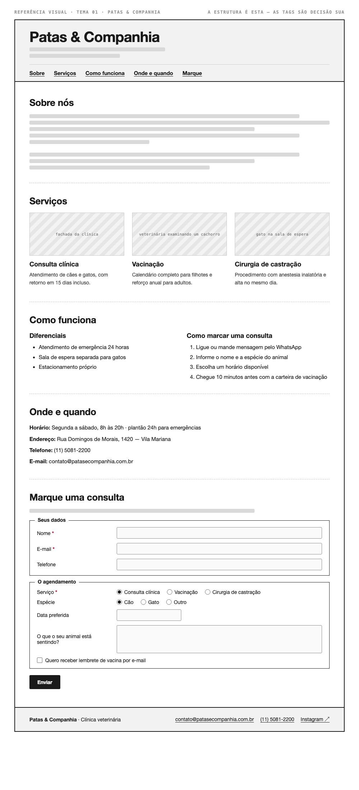

# Tema 01 · Patas & Companhia

**Clínica veterinária** · Vila Mariana, São Paulo

A imagem acima mostra a página montada, só para você **ler a hierarquia**: o que é o título principal, o que é título de seção, o que é item dentro de uma seção, o que é lista e de que tipo, como os campos do formulário se agrupam. Ela não tem nenhuma tag escrita — descobrir qual tag produz cada pedaço é a prova. E não é para reproduzir o visual: a sua página não terá CSS e vai ficar diferente disso, o que é esperado.

Este é o conteúdo da sua página. Os fatos são estes; **o texto é seu** — escreva os parágrafos com as suas palavras, em português correto, no tom que combina com a organização. Os itens das listas e os dados da tabela final podem ir como estão; a apresentação e as descrições dos artigos, não — reescreva.

O que você **não** decide: a estrutura mínima exigida no enunciado. O que você decide: qual tag marca cada pedaço deste conteúdo.

---

## Quem é

Patas & Companhia é clínica veterinária em Vila Mariana, São Paulo. Escreva um parágrafo de apresentação (2 a 4 frases) e um slogan curto. Invente o que faltar — ano de fundação, quem fundou, por quê — desde que seja coerente com o resto.

## Serviços — os 3 artigos

Cada item vira um `<article>` com título, um parágrafo e uma imagem.

- **Consulta clínica** — atendimento de cães e gatos, com retorno em 15 dias incluso
- **Vacinação** — calendário completo para filhotes e reforço anual para adultos
- **Cirurgia de castração** — procedimento com anestesia inalatória e alta no mesmo dia

## Diferenciais — lista não ordenada

- Atendimento de emergência 24 horas
- Sala de espera separada para gatos
- Estacionamento próprio

## Como marcar uma consulta — lista ordenada

1. Ligue ou mande mensagem pelo WhatsApp
2. Informe o nome e a espécie do animal
3. Escolha um horário disponível
4. Chegue 10 minutos antes com a carteira de vacinação

## Dados — quatro parágrafos

Sem `<dl>` (não vimos em aula): um parágrafo por dado, com o rótulo em destaque no início.

| | |
| --- | --- |
| Horário | Segunda a sábado, 8h às 20h · plantão 24h para emergências |
| Endereço | Rua Domingos de Morais, 1420 — Vila Mariana |
| Telefone | (11) 5081-2200 |
| E-mail | contato@patasecompanhia.com.br |

## Marque uma consulta — formulário

A quinta seção é um formulário. Os campos fixos, iguais para todo mundo: **nome** (texto), **e-mail** e **telefone**. Os campos específicos do seu tema (sem `<select>` — não vimos em aula):

| Campo | Tipo | Opções |
| --- | --- | --- |
| Serviço | escolha única, todas as opções visíveis | Consulta clínica · Vacinação · Cirurgia de castração |
| Espécie | escolha única, todas as opções visíveis | Cão · Gato · Outro |
| Data preferida | data | — |
| O que o seu animal está sentindo? | texto longo | — |
| Quero receber lembrete de vacina por e-mail | marcar ou não | — |

Agrupe os campos em **dois blocos** com título — "Seus dados" e "O agendamento", ou o que fizer sentido — e termine com o botão de envio. Decida você quais campos são obrigatórios. A tabela diz o *tipo de informação*; qual tag e qual `type` traduzem isso é decisão sua.

## Imagens

Três fotos, uma por artigo: fachada da clínica, veterinária examinando um cachorro, gato na sala de espera.

Use imagens de placeholder — `https://picsum.photos/400/300` serve — ou qualquer foto livre. **O que é avaliado é o `alt`**, que precisa descrever a foto como se ela não carregasse. O `alt` é o único lugar em que você usa o texto desta seção.
