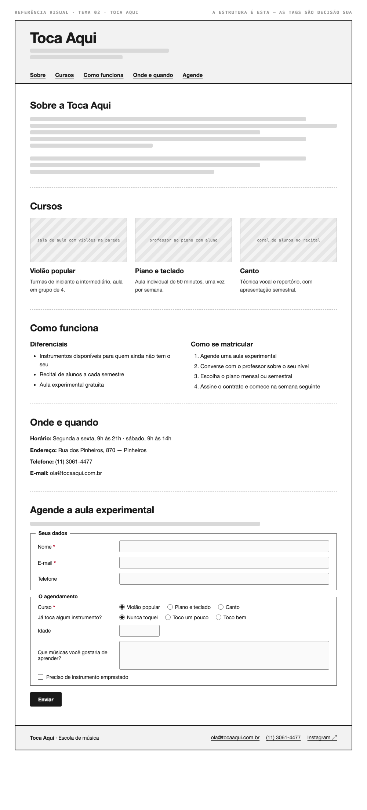

# Tema 02 · Toca Aqui

**Escola de música** · Pinheiros, São Paulo

A imagem acima mostra a página montada, só para você **ler a hierarquia**: o que é o título principal, o que é título de seção, o que é item dentro de uma seção, o que é lista e de que tipo, como os campos do formulário se agrupam. Ela não tem nenhuma tag escrita — descobrir qual tag produz cada pedaço é a prova. E não é para reproduzir o visual: a sua página não terá CSS e vai ficar diferente disso, o que é esperado.

Este é o conteúdo da sua página. Os fatos são estes; **o texto é seu** — escreva os parágrafos com as suas palavras, em português correto, no tom que combina com a organização. Os itens das listas e os dados da tabela final podem ir como estão; a apresentação e as descrições dos artigos, não — reescreva.

O que você **não** decide: a estrutura mínima exigida no enunciado. O que você decide: qual tag marca cada pedaço deste conteúdo.

---

## Quem é

Toca Aqui é escola de música em Pinheiros, São Paulo. Escreva um parágrafo de apresentação (2 a 4 frases) e um slogan curto. Invente o que faltar — ano de fundação, quem fundou, por quê — desde que seja coerente com o resto.

## Cursos — os 3 artigos

Cada item vira um `<article>` com título, um parágrafo e uma imagem.

- **Violão popular** — turmas de iniciante a intermediário, aula em grupo de 4
- **Piano e teclado** — aula individual de 50 minutos, uma vez por semana
- **Canto** — técnica vocal e repertório, com apresentação semestral

## Diferenciais — lista não ordenada

- Instrumentos disponíveis para quem ainda não tem o seu
- Recital de alunos a cada semestre
- Aula experimental gratuita

## Como se matricular — lista ordenada

1. Agende uma aula experimental
2. Converse com o professor sobre o seu nível
3. Escolha o plano mensal ou semestral
4. Assine o contrato e comece na semana seguinte

## Dados — quatro parágrafos

Sem `<dl>` (não vimos em aula): um parágrafo por dado, com o rótulo em destaque no início.

| | |
| --- | --- |
| Horário | Segunda a sexta, 9h às 21h · sábado, 9h às 14h |
| Endereço | Rua dos Pinheiros, 870 — Pinheiros |
| Telefone | (11) 3061-4477 |
| E-mail | ola@tocaaqui.com.br |

## Agende a aula experimental — formulário

A quinta seção é um formulário. Os campos fixos, iguais para todo mundo: **nome** (texto), **e-mail** e **telefone**. Os campos específicos do seu tema (sem `<select>` — não vimos em aula):

| Campo | Tipo | Opções |
| --- | --- | --- |
| Curso | escolha única, todas as opções visíveis | Violão popular · Piano e teclado · Canto |
| Já toca algum instrumento? | escolha única, todas as opções visíveis | Nunca toquei · Toco um pouco · Toco bem |
| Idade | número | — |
| Que músicas você gostaria de aprender? | texto longo | — |
| Preciso de instrumento emprestado | marcar ou não | — |

Agrupe os campos em **dois blocos** com título — "Seus dados" e "O agendamento", ou o que fizer sentido — e termine com o botão de envio. Decida você quais campos são obrigatórios. A tabela diz o *tipo de informação*; qual tag e qual `type` traduzem isso é decisão sua.

## Imagens

Três fotos, uma por artigo: sala de aula com violões na parede, professor ao piano com aluno, coral de alunos no recital.

Use imagens de placeholder — `https://picsum.photos/400/300` serve — ou qualquer foto livre. **O que é avaliado é o `alt`**, que precisa descrever a foto como se ela não carregasse. O `alt` é o único lugar em que você usa o texto desta seção.
