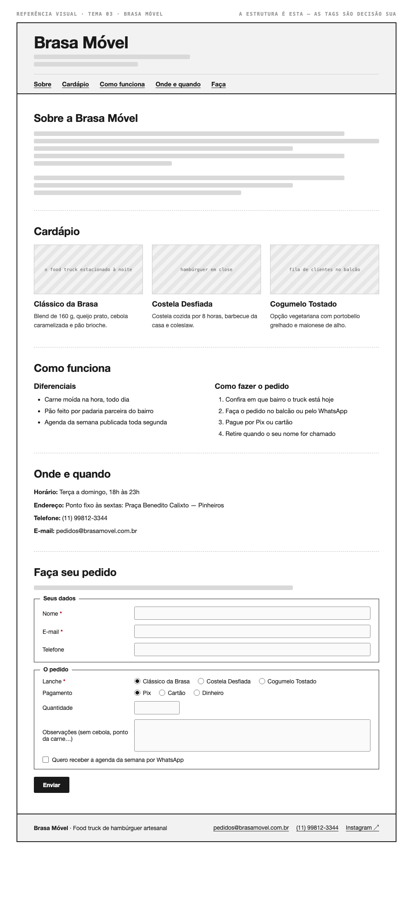

# Tema 03 · Brasa Móvel

**Food truck de hambúrguer artesanal** · Roda por bairros da zona oeste de São Paulo

A imagem acima mostra a página montada, só para você **ler a hierarquia**: o que é o título principal, o que é título de seção, o que é item dentro de uma seção, o que é lista e de que tipo, como os campos do formulário se agrupam. Ela não tem nenhuma tag escrita — descobrir qual tag produz cada pedaço é a prova. E não é para reproduzir o visual: a sua página não terá CSS e vai ficar diferente disso, o que é esperado.

Este é o conteúdo da sua página. Os fatos são estes; **o texto é seu** — escreva os parágrafos com as suas palavras, em português correto, no tom que combina com a organização. Os itens das listas e os dados da tabela final podem ir como estão; a apresentação e as descrições dos artigos, não — reescreva.

O que você **não** decide: a estrutura mínima exigida no enunciado. O que você decide: qual tag marca cada pedaço deste conteúdo.

---

## Quem é

Brasa Móvel é food truck de hambúrguer artesanal em Roda por bairros da zona oeste de São Paulo. Escreva um parágrafo de apresentação (2 a 4 frases) e um slogan curto. Invente o que faltar — ano de fundação, quem fundou, por quê — desde que seja coerente com o resto.

## Cardápio — os 3 artigos

Cada item vira um `<article>` com título, um parágrafo e uma imagem.

- **Clássico da Brasa** — blend de 160 g, queijo prato, cebola caramelizada e pão brioche
- **Costela Desfiada** — costela cozida por 8 horas, barbecue da casa e coleslaw
- **Cogumelo Tostado** — opção vegetariana com portobello grelhado e maionese de alho

## Diferenciais — lista não ordenada

- Carne moída na hora, todo dia
- Pão feito por padaria parceira do bairro
- Agenda da semana publicada toda segunda

## Como fazer o pedido — lista ordenada

1. Confira em que bairro o truck está hoje
2. Faça o pedido no balcão ou pelo WhatsApp
3. Pague por Pix ou cartão
4. Retire quando o seu nome for chamado

## Dados — quatro parágrafos

Sem `<dl>` (não vimos em aula): um parágrafo por dado, com o rótulo em destaque no início.

| | |
| --- | --- |
| Horário | Terça a domingo, 18h às 23h |
| Endereço | Ponto fixo às sextas: Praça Benedito Calixto — Pinheiros |
| Telefone | (11) 99812-3344 |
| E-mail | pedidos@brasamovel.com.br |

## Faça seu pedido — formulário

A quinta seção é um formulário. Os campos fixos, iguais para todo mundo: **nome** (texto), **e-mail** e **telefone**. Os campos específicos do seu tema (sem `<select>` — não vimos em aula):

| Campo | Tipo | Opções |
| --- | --- | --- |
| Lanche | escolha única, todas as opções visíveis | Clássico da Brasa · Costela Desfiada · Cogumelo Tostado |
| Pagamento | escolha única, todas as opções visíveis | Pix · Cartão · Dinheiro |
| Quantidade | número | — |
| Observações (sem cebola, ponto da carne…) | texto longo | — |
| Quero receber a agenda da semana por WhatsApp | marcar ou não | — |

Agrupe os campos em **dois blocos** com título — "Seus dados" e "O pedido", ou o que fizer sentido — e termine com o botão de envio. Decida você quais campos são obrigatórios. A tabela diz o *tipo de informação*; qual tag e qual `type` traduzem isso é decisão sua.

## Imagens

Três fotos, uma por artigo: o food truck estacionado à noite, hambúrguer em close, fila de clientes no balcão.

Use imagens de placeholder — `https://picsum.photos/400/300` serve — ou qualquer foto livre. **O que é avaliado é o `alt`**, que precisa descrever a foto como se ela não carregasse. O `alt` é o único lugar em que você usa o texto desta seção.
