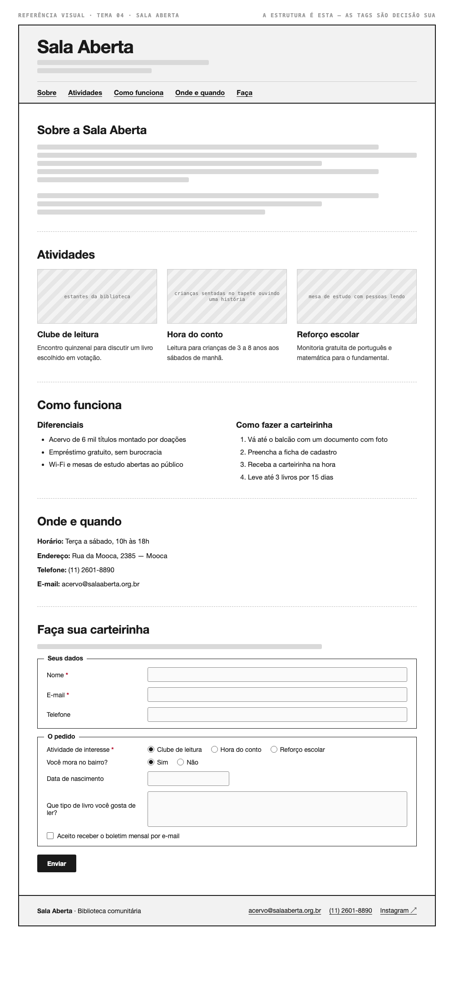

# Tema 04 · Sala Aberta

**Biblioteca comunitária** · Mooca, São Paulo

A imagem acima mostra a página montada, só para você **ler a hierarquia**: o que é o título principal, o que é título de seção, o que é item dentro de uma seção, o que é lista e de que tipo, como os campos do formulário se agrupam. Ela não tem nenhuma tag escrita — descobrir qual tag produz cada pedaço é a prova. E não é para reproduzir o visual: a sua página não terá CSS e vai ficar diferente disso, o que é esperado.

Este é o conteúdo da sua página. Os fatos são estes; **o texto é seu** — escreva os parágrafos com as suas palavras, em português correto, no tom que combina com a organização. Os itens das listas e os dados da tabela final podem ir como estão; a apresentação e as descrições dos artigos, não — reescreva.

O que você **não** decide: a estrutura mínima exigida no enunciado. O que você decide: qual tag marca cada pedaço deste conteúdo.

---

## Quem é

Sala Aberta é biblioteca comunitária em Mooca, São Paulo. Escreva um parágrafo de apresentação (2 a 4 frases) e um slogan curto. Invente o que faltar — ano de fundação, quem fundou, por quê — desde que seja coerente com o resto.

## Atividades — os 3 artigos

Cada item vira um `<article>` com título, um parágrafo e uma imagem.

- **Clube de leitura** — encontro quinzenal para discutir um livro escolhido em votação
- **Hora do conto** — leitura para crianças de 3 a 8 anos aos sábados de manhã
- **Reforço escolar** — monitoria gratuita de português e matemática para o fundamental

## Diferenciais — lista não ordenada

- Acervo de 6 mil títulos montado por doações
- Empréstimo gratuito, sem burocracia
- Wi-Fi e mesas de estudo abertas ao público

## Como fazer a carteirinha — lista ordenada

1. Vá até o balcão com um documento com foto
2. Preencha a ficha de cadastro
3. Receba a carteirinha na hora
4. Leve até 3 livros por 15 dias

## Dados — quatro parágrafos

Sem `<dl>` (não vimos em aula): um parágrafo por dado, com o rótulo em destaque no início.

| | |
| --- | --- |
| Horário | Terça a sábado, 10h às 18h |
| Endereço | Rua da Mooca, 2385 — Mooca |
| Telefone | (11) 2601-8890 |
| E-mail | acervo@salaaberta.org.br |

## Faça sua carteirinha — formulário

A quinta seção é um formulário. Os campos fixos, iguais para todo mundo: **nome** (texto), **e-mail** e **telefone**. Os campos específicos do seu tema (sem `<select>` — não vimos em aula):

| Campo | Tipo | Opções |
| --- | --- | --- |
| Atividade de interesse | escolha única, todas as opções visíveis | Clube de leitura · Hora do conto · Reforço escolar |
| Você mora no bairro? | escolha única, todas as opções visíveis | Sim · Não |
| Data de nascimento | data | — |
| Que tipo de livro você gosta de ler? | texto longo | — |
| Aceito receber o boletim mensal por e-mail | marcar ou não | — |

Agrupe os campos em **dois blocos** com título — "Seus dados" e "O pedido", ou o que fizer sentido — e termine com o botão de envio. Decida você quais campos são obrigatórios. A tabela diz o *tipo de informação*; qual tag e qual `type` traduzem isso é decisão sua.

## Imagens

Três fotos, uma por artigo: estantes da biblioteca, crianças sentadas no tapete ouvindo uma história, mesa de estudo com pessoas lendo.

Use imagens de placeholder — `https://picsum.photos/400/300` serve — ou qualquer foto livre. **O que é avaliado é o `alt`**, que precisa descrever a foto como se ela não carregasse. O `alt` é o único lugar em que você usa o texto desta seção.
