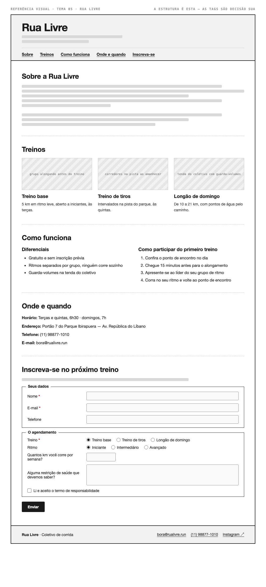

# Tema 05 · Rua Livre

**Coletivo de corrida** · Parque Ibirapuera, São Paulo

A imagem acima mostra a página montada, só para você **ler a hierarquia**: o que é o título principal, o que é título de seção, o que é item dentro de uma seção, o que é lista e de que tipo, como os campos do formulário se agrupam. Ela não tem nenhuma tag escrita — descobrir qual tag produz cada pedaço é a prova. E não é para reproduzir o visual: a sua página não terá CSS e vai ficar diferente disso, o que é esperado.

Este é o conteúdo da sua página. Os fatos são estes; **o texto é seu** — escreva os parágrafos com as suas palavras, em português correto, no tom que combina com a organização. Os itens das listas e os dados da tabela final podem ir como estão; a apresentação e as descrições dos artigos, não — reescreva.

O que você **não** decide: a estrutura mínima exigida no enunciado. O que você decide: qual tag marca cada pedaço deste conteúdo.

---

## Quem é

Rua Livre é coletivo de corrida em Parque Ibirapuera, São Paulo. Escreva um parágrafo de apresentação (2 a 4 frases) e um slogan curto. Invente o que faltar — ano de fundação, quem fundou, por quê — desde que seja coerente com o resto.

## Treinos — os 3 artigos

Cada item vira um `<article>` com título, um parágrafo e uma imagem.

- **Treino base** — 5 km em ritmo leve, aberto a iniciantes, às terças
- **Treino de tiros** — intervalados na pista do parque, às quintas
- **Longão de domingo** — de 10 a 21 km, com pontos de água pelo caminho

## Diferenciais — lista não ordenada

- Gratuito e sem inscrição prévia
- Ritmos separados por grupo, ninguém corre sozinho
- Guarda-volumes na tenda do coletivo

## Como participar do primeiro treino — lista ordenada

1. Confira o ponto de encontro no dia
2. Chegue 15 minutos antes para o alongamento
3. Apresente-se ao líder do seu grupo de ritmo
4. Corra no seu ritmo e volte ao ponto de encontro

## Dados — quatro parágrafos

Sem `<dl>` (não vimos em aula): um parágrafo por dado, com o rótulo em destaque no início.

| | |
| --- | --- |
| Horário | Terças e quintas, 6h30 · domingos, 7h |
| Endereço | Portão 7 do Parque Ibirapuera — Av. República do Líbano |
| Telefone | (11) 98877-1010 |
| E-mail | bora@rualivre.run |

## Inscreva-se no próximo treino — formulário

A quinta seção é um formulário. Os campos fixos, iguais para todo mundo: **nome** (texto), **e-mail** e **telefone**. Os campos específicos do seu tema (sem `<select>` — não vimos em aula):

| Campo | Tipo | Opções |
| --- | --- | --- |
| Treino | escolha única, todas as opções visíveis | Treino base · Treino de tiros · Longão de domingo |
| Ritmo | escolha única, todas as opções visíveis | Iniciante · Intermediário · Avançado |
| Quantos km você corre por semana? | número | — |
| Alguma restrição de saúde que devemos saber? | texto longo | — |
| Li e aceito o termo de responsabilidade | marcar ou não | — |

Agrupe os campos em **dois blocos** com título — "Seus dados" e "O agendamento", ou o que fizer sentido — e termine com o botão de envio. Decida você quais campos são obrigatórios. A tabela diz o *tipo de informação*; qual tag e qual `type` traduzem isso é decisão sua.

## Imagens

Três fotos, uma por artigo: grupo alongando antes do treino, corredores na pista ao amanhecer, tenda do coletivo com guarda-volumes.

Use imagens de placeholder — `https://picsum.photos/400/300` serve — ou qualquer foto livre. **O que é avaliado é o `alt`**, que precisa descrever a foto como se ela não carregasse. O `alt` é o único lugar em que você usa o texto desta seção.
