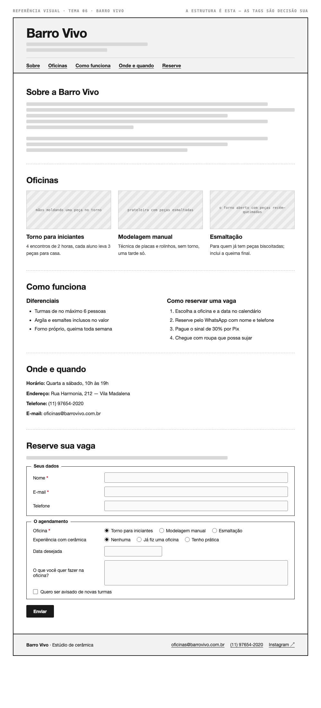

# Tema 06 · Barro Vivo

**Estúdio de cerâmica** · Vila Madalena, São Paulo

A imagem acima mostra a página montada, só para você **ler a hierarquia**: o que é o título principal, o que é título de seção, o que é item dentro de uma seção, o que é lista e de que tipo, como os campos do formulário se agrupam. Ela não tem nenhuma tag escrita — descobrir qual tag produz cada pedaço é a prova. E não é para reproduzir o visual: a sua página não terá CSS e vai ficar diferente disso, o que é esperado.

Este é o conteúdo da sua página. Os fatos são estes; **o texto é seu** — escreva os parágrafos com as suas palavras, em português correto, no tom que combina com a organização. Os itens das listas e os dados da tabela final podem ir como estão; a apresentação e as descrições dos artigos, não — reescreva.

O que você **não** decide: a estrutura mínima exigida no enunciado. O que você decide: qual tag marca cada pedaço deste conteúdo.

---

## Quem é

Barro Vivo é estúdio de cerâmica em Vila Madalena, São Paulo. Escreva um parágrafo de apresentação (2 a 4 frases) e um slogan curto. Invente o que faltar — ano de fundação, quem fundou, por quê — desde que seja coerente com o resto.

## Oficinas — os 3 artigos

Cada item vira um `<article>` com título, um parágrafo e uma imagem.

- **Torno para iniciantes** — 4 encontros de 2 horas, cada aluno leva 3 peças para casa
- **Modelagem manual** — técnica de placas e rolinhos, sem torno, uma tarde só
- **Esmaltação** — para quem já tem peças biscoitadas; inclui a queima final

## Diferenciais — lista não ordenada

- Turmas de no máximo 6 pessoas
- Argila e esmaltes inclusos no valor
- Forno próprio, queima toda semana

## Como reservar uma vaga — lista ordenada

1. Escolha a oficina e a data no calendário
2. Reserve pelo WhatsApp com nome e telefone
3. Pague o sinal de 30% por Pix
4. Chegue com roupa que possa sujar

## Dados — quatro parágrafos

Sem `<dl>` (não vimos em aula): um parágrafo por dado, com o rótulo em destaque no início.

| | |
| --- | --- |
| Horário | Quarta a sábado, 10h às 19h |
| Endereço | Rua Harmonia, 212 — Vila Madalena |
| Telefone | (11) 97654-2020 |
| E-mail | oficinas@barrovivo.com.br |

## Reserve sua vaga — formulário

A quinta seção é um formulário. Os campos fixos, iguais para todo mundo: **nome** (texto), **e-mail** e **telefone**. Os campos específicos do seu tema (sem `<select>` — não vimos em aula):

| Campo | Tipo | Opções |
| --- | --- | --- |
| Oficina | escolha única, todas as opções visíveis | Torno para iniciantes · Modelagem manual · Esmaltação |
| Experiência com cerâmica | escolha única, todas as opções visíveis | Nenhuma · Já fiz uma oficina · Tenho prática |
| Data desejada | data | — |
| O que você quer fazer na oficina? | texto longo | — |
| Quero ser avisado de novas turmas | marcar ou não | — |

Agrupe os campos em **dois blocos** com título — "Seus dados" e "O agendamento", ou o que fizer sentido — e termine com o botão de envio. Decida você quais campos são obrigatórios. A tabela diz o *tipo de informação*; qual tag e qual `type` traduzem isso é decisão sua.

## Imagens

Três fotos, uma por artigo: mãos moldando uma peça no torno, prateleira com peças esmaltadas, o forno aberto com peças recém-queimadas.

Use imagens de placeholder — `https://picsum.photos/400/300` serve — ou qualquer foto livre. **O que é avaliado é o `alt`**, que precisa descrever a foto como se ela não carregasse. O `alt` é o único lugar em que você usa o texto desta seção.
