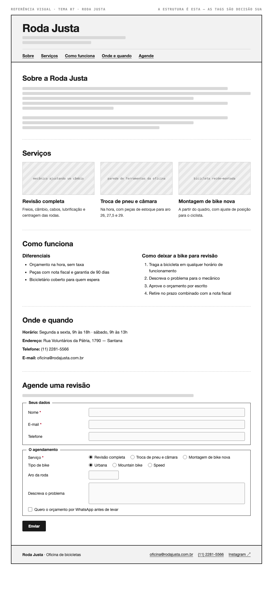

# Tema 07 · Roda Justa

**Oficina de bicicletas** · Santana, São Paulo

A imagem acima mostra a página montada, só para você **ler a hierarquia**: o que é o título principal, o que é título de seção, o que é item dentro de uma seção, o que é lista e de que tipo, como os campos do formulário se agrupam. Ela não tem nenhuma tag escrita — descobrir qual tag produz cada pedaço é a prova. E não é para reproduzir o visual: a sua página não terá CSS e vai ficar diferente disso, o que é esperado.

Este é o conteúdo da sua página. Os fatos são estes; **o texto é seu** — escreva os parágrafos com as suas palavras, em português correto, no tom que combina com a organização. Os itens das listas e os dados da tabela final podem ir como estão; a apresentação e as descrições dos artigos, não — reescreva.

O que você **não** decide: a estrutura mínima exigida no enunciado. O que você decide: qual tag marca cada pedaço deste conteúdo.

---

## Quem é

Roda Justa é oficina de bicicletas em Santana, São Paulo. Escreva um parágrafo de apresentação (2 a 4 frases) e um slogan curto. Invente o que faltar — ano de fundação, quem fundou, por quê — desde que seja coerente com o resto.

## Serviços — os 3 artigos

Cada item vira um `<article>` com título, um parágrafo e uma imagem.

- **Revisão completa** — freios, câmbio, cabos, lubrificação e centragem das rodas
- **Troca de pneu e câmara** — na hora, com peças de estoque para aro 26, 27,5 e 29
- **Montagem de bike nova** — a partir do quadro, com ajuste de posição para o ciclista

## Diferenciais — lista não ordenada

- Orçamento na hora, sem taxa
- Peças com nota fiscal e garantia de 90 dias
- Bicicletário coberto para quem espera

## Como deixar a bike para revisão — lista ordenada

1. Traga a bicicleta em qualquer horário de funcionamento
2. Descreva o problema para o mecânico
3. Aprove o orçamento por escrito
4. Retire no prazo combinado com a nota fiscal

## Dados — quatro parágrafos

Sem `<dl>` (não vimos em aula): um parágrafo por dado, com o rótulo em destaque no início.

| | |
| --- | --- |
| Horário | Segunda a sexta, 9h às 18h · sábado, 9h às 13h |
| Endereço | Rua Voluntários da Pátria, 1790 — Santana |
| Telefone | (11) 2281-5566 |
| E-mail | oficina@rodajusta.com.br |

## Agende uma revisão — formulário

A quinta seção é um formulário. Os campos fixos, iguais para todo mundo: **nome** (texto), **e-mail** e **telefone**. Os campos específicos do seu tema (sem `<select>` — não vimos em aula):

| Campo | Tipo | Opções |
| --- | --- | --- |
| Serviço | escolha única, todas as opções visíveis | Revisão completa · Troca de pneu e câmara · Montagem de bike nova |
| Tipo de bike | escolha única, todas as opções visíveis | Urbana · Mountain bike · Speed |
| Aro da roda | número | — |
| Descreva o problema | texto longo | — |
| Quero o orçamento por WhatsApp antes de levar | marcar ou não | — |

Agrupe os campos em **dois blocos** com título — "Seus dados" e "O agendamento", ou o que fizer sentido — e termine com o botão de envio. Decida você quais campos são obrigatórios. A tabela diz o *tipo de informação*; qual tag e qual `type` traduzem isso é decisão sua.

## Imagens

Três fotos, uma por artigo: mecânico ajustando um câmbio, parede de ferramentas da oficina, bicicleta recém-montada.

Use imagens de placeholder — `https://picsum.photos/400/300` serve — ou qualquer foto livre. **O que é avaliado é o `alt`**, que precisa descrever a foto como se ela não carregasse. O `alt` é o único lugar em que você usa o texto desta seção.
