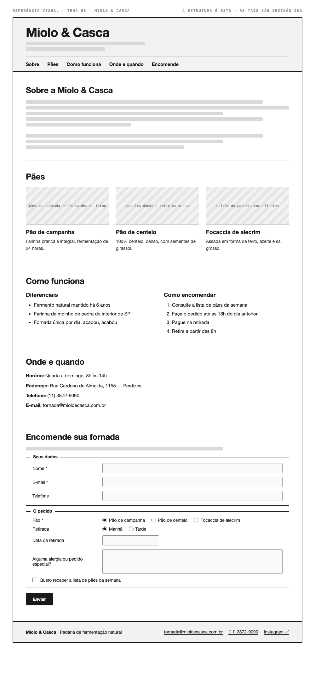

# Tema 08 · Miolo & Casca

**Padaria de fermentação natural** · Perdizes, São Paulo

A imagem acima mostra a página montada, só para você **ler a hierarquia**: o que é o título principal, o que é título de seção, o que é item dentro de uma seção, o que é lista e de que tipo, como os campos do formulário se agrupam. Ela não tem nenhuma tag escrita — descobrir qual tag produz cada pedaço é a prova. E não é para reproduzir o visual: a sua página não terá CSS e vai ficar diferente disso, o que é esperado.

Este é o conteúdo da sua página. Os fatos são estes; **o texto é seu** — escreva os parágrafos com as suas palavras, em português correto, no tom que combina com a organização. Os itens das listas e os dados da tabela final podem ir como estão; a apresentação e as descrições dos artigos, não — reescreva.

O que você **não** decide: a estrutura mínima exigida no enunciado. O que você decide: qual tag marca cada pedaço deste conteúdo.

---

## Quem é

Miolo & Casca é padaria de fermentação natural em Perdizes, São Paulo. Escreva um parágrafo de apresentação (2 a 4 frases) e um slogan curto. Invente o que faltar — ano de fundação, quem fundou, por quê — desde que seja coerente com o resto.

## Pães — os 3 artigos

Cada item vira um `<article>` com título, um parágrafo e uma imagem.

- **Pão de campanha** — farinha branca e integral, fermentação de 24 horas
- **Pão de centeio** — 100% centeio, denso, com sementes de girassol
- **Focaccia de alecrim** — assada em forma de ferro, azeite e sal grosso

## Diferenciais — lista não ordenada

- Fermento natural mantido há 6 anos
- Farinha de moinho de pedra do interior de SP
- Fornada única por dia: acabou, acabou

## Como encomendar — lista ordenada

1. Consulte a lista de pães da semana
2. Faça o pedido até as 18h do dia anterior
3. Pague na retirada
4. Retire a partir das 8h

## Dados — quatro parágrafos

Sem `<dl>` (não vimos em aula): um parágrafo por dado, com o rótulo em destaque no início.

| | |
| --- | --- |
| Horário | Quarta a domingo, 8h às 14h |
| Endereço | Rua Cardoso de Almeida, 1155 — Perdizes |
| Telefone | (11) 3872-9090 |
| E-mail | fornada@mioloecasca.com.br |

## Encomende sua fornada — formulário

A quinta seção é um formulário. Os campos fixos, iguais para todo mundo: **nome** (texto), **e-mail** e **telefone**. Os campos específicos do seu tema (sem `<select>` — não vimos em aula):

| Campo | Tipo | Opções |
| --- | --- | --- |
| Pão | escolha única, todas as opções visíveis | Pão de campanha · Pão de centeio · Focaccia de alecrim |
| Retirada | escolha única, todas as opções visíveis | Manhã · Tarde |
| Data da retirada | data | — |
| Alguma alergia ou pedido especial? | texto longo | — |
| Quero receber a lista de pães da semana | marcar ou não | — |

Agrupe os campos em **dois blocos** com título — "Seus dados" e "O agendamento", ou o que fizer sentido — e termine com o botão de envio. Decida você quais campos são obrigatórios. A tabela diz o *tipo de informação*; qual tag e qual `type` traduzem isso é decisão sua.

## Imagens

Três fotos, uma por artigo: pães na bancada recém-saídos do forno, padeiro dando o corte na massa, balcão da padaria com clientes.

Use imagens de placeholder — `https://picsum.photos/400/300` serve — ou qualquer foto livre. **O que é avaliado é o `alt`**, que precisa descrever a foto como se ela não carregasse. O `alt` é o único lugar em que você usa o texto desta seção.
