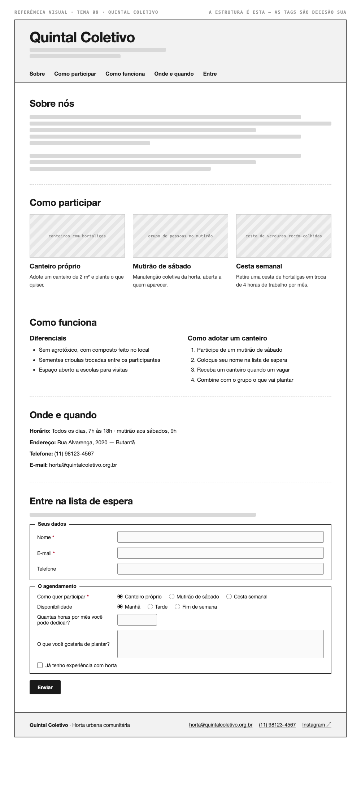

# Tema 09 · Quintal Coletivo

**Horta urbana comunitária** · Butantã, São Paulo

A imagem acima mostra a página montada, só para você **ler a hierarquia**: o que é o título principal, o que é título de seção, o que é item dentro de uma seção, o que é lista e de que tipo, como os campos do formulário se agrupam. Ela não tem nenhuma tag escrita — descobrir qual tag produz cada pedaço é a prova. E não é para reproduzir o visual: a sua página não terá CSS e vai ficar diferente disso, o que é esperado.

Este é o conteúdo da sua página. Os fatos são estes; **o texto é seu** — escreva os parágrafos com as suas palavras, em português correto, no tom que combina com a organização. Os itens das listas e os dados da tabela final podem ir como estão; a apresentação e as descrições dos artigos, não — reescreva.

O que você **não** decide: a estrutura mínima exigida no enunciado. O que você decide: qual tag marca cada pedaço deste conteúdo.

---

## Quem é

Quintal Coletivo é horta urbana comunitária em Butantã, São Paulo. Escreva um parágrafo de apresentação (2 a 4 frases) e um slogan curto. Invente o que faltar — ano de fundação, quem fundou, por quê — desde que seja coerente com o resto.

## Como participar — os 3 artigos

Cada item vira um `<article>` com título, um parágrafo e uma imagem.

- **Canteiro próprio** — adote um canteiro de 2 m² e plante o que quiser
- **Mutirão de sábado** — manutenção coletiva da horta, aberta a quem aparecer
- **Cesta semanal** — retire uma cesta de hortaliças em troca de 4 horas de trabalho por mês

## Diferenciais — lista não ordenada

- Sem agrotóxico, com composto feito no local
- Sementes crioulas trocadas entre os participantes
- Espaço aberto a escolas para visitas

## Como adotar um canteiro — lista ordenada

1. Participe de um mutirão de sábado
2. Coloque seu nome na lista de espera
3. Receba um canteiro quando um vagar
4. Combine com o grupo o que vai plantar

## Dados — quatro parágrafos

Sem `<dl>` (não vimos em aula): um parágrafo por dado, com o rótulo em destaque no início.

| | |
| --- | --- |
| Horário | Todos os dias, 7h às 18h · mutirão aos sábados, 9h |
| Endereço | Rua Alvarenga, 2020 — Butantã |
| Telefone | (11) 98123-4567 |
| E-mail | horta@quintalcoletivo.org.br |

## Entre na lista de espera — formulário

A quinta seção é um formulário. Os campos fixos, iguais para todo mundo: **nome** (texto), **e-mail** e **telefone**. Os campos específicos do seu tema (sem `<select>` — não vimos em aula):

| Campo | Tipo | Opções |
| --- | --- | --- |
| Como quer participar | escolha única, todas as opções visíveis | Canteiro próprio · Mutirão de sábado · Cesta semanal |
| Disponibilidade | escolha única, todas as opções visíveis | Manhã · Tarde · Fim de semana |
| Quantas horas por mês você pode dedicar? | número | — |
| O que você gostaria de plantar? | texto longo | — |
| Já tenho experiência com horta | marcar ou não | — |

Agrupe os campos em **dois blocos** com título — "Seus dados" e "O agendamento", ou o que fizer sentido — e termine com o botão de envio. Decida você quais campos são obrigatórios. A tabela diz o *tipo de informação*; qual tag e qual `type` traduzem isso é decisão sua.

## Imagens

Três fotos, uma por artigo: canteiros com hortaliças, grupo de pessoas no mutirão, cesta de verduras recém-colhidas.

Use imagens de placeholder — `https://picsum.photos/400/300` serve — ou qualquer foto livre. **O que é avaliado é o `alt`**, que precisa descrever a foto como se ela não carregasse. O `alt` é o único lugar em que você usa o texto desta seção.
