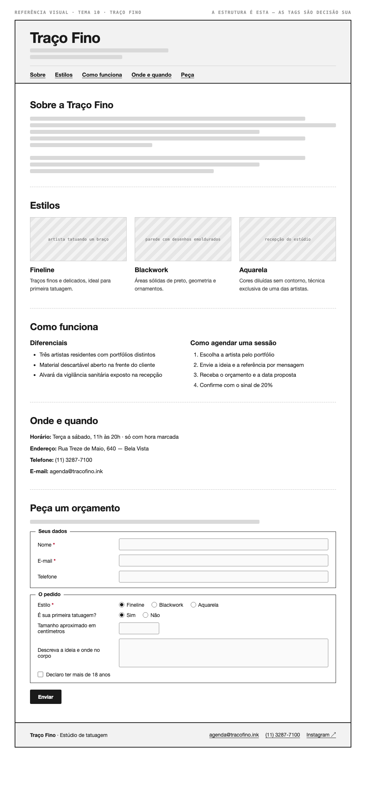

# Tema 10 · Traço Fino

**Estúdio de tatuagem** · Bela Vista, São Paulo

A imagem acima mostra a página montada, só para você **ler a hierarquia**: o que é o título principal, o que é título de seção, o que é item dentro de uma seção, o que é lista e de que tipo, como os campos do formulário se agrupam. Ela não tem nenhuma tag escrita — descobrir qual tag produz cada pedaço é a prova. E não é para reproduzir o visual: a sua página não terá CSS e vai ficar diferente disso, o que é esperado.

Este é o conteúdo da sua página. Os fatos são estes; **o texto é seu** — escreva os parágrafos com as suas palavras, em português correto, no tom que combina com a organização. Os itens das listas e os dados da tabela final podem ir como estão; a apresentação e as descrições dos artigos, não — reescreva.

O que você **não** decide: a estrutura mínima exigida no enunciado. O que você decide: qual tag marca cada pedaço deste conteúdo.

---

## Quem é

Traço Fino é estúdio de tatuagem em Bela Vista, São Paulo. Escreva um parágrafo de apresentação (2 a 4 frases) e um slogan curto. Invente o que faltar — ano de fundação, quem fundou, por quê — desde que seja coerente com o resto.

## Estilos — os 3 artigos

Cada item vira um `<article>` com título, um parágrafo e uma imagem.

- **Fineline** — traços finos e delicados, ideal para primeira tatuagem
- **Blackwork** — áreas sólidas de preto, geometria e ornamentos
- **Aquarela** — cores diluídas sem contorno, técnica exclusiva de uma das artistas

## Diferenciais — lista não ordenada

- Três artistas residentes com portfólios distintos
- Material descartável aberto na frente do cliente
- Alvará da vigilância sanitária exposto na recepção

## Como agendar uma sessão — lista ordenada

1. Escolha a artista pelo portfólio
2. Envie a ideia e a referência por mensagem
3. Receba o orçamento e a data proposta
4. Confirme com o sinal de 20%

## Dados — quatro parágrafos

Sem `<dl>` (não vimos em aula): um parágrafo por dado, com o rótulo em destaque no início.

| | |
| --- | --- |
| Horário | Terça a sábado, 11h às 20h · só com hora marcada |
| Endereço | Rua Treze de Maio, 640 — Bela Vista |
| Telefone | (11) 3287-7100 |
| E-mail | agenda@tracofino.ink |

## Peça um orçamento — formulário

A quinta seção é um formulário. Os campos fixos, iguais para todo mundo: **nome** (texto), **e-mail** e **telefone**. Os campos específicos do seu tema (sem `<select>` — não vimos em aula):

| Campo | Tipo | Opções |
| --- | --- | --- |
| Estilo | escolha única, todas as opções visíveis | Fineline · Blackwork · Aquarela |
| É sua primeira tatuagem? | escolha única, todas as opções visíveis | Sim · Não |
| Tamanho aproximado em centímetros | número | — |
| Descreva a ideia e onde no corpo | texto longo | — |
| Declaro ter mais de 18 anos | marcar ou não | — |

Agrupe os campos em **dois blocos** com título — "Seus dados" e "O pedido", ou o que fizer sentido — e termine com o botão de envio. Decida você quais campos são obrigatórios. A tabela diz o *tipo de informação*; qual tag e qual `type` traduzem isso é decisão sua.

## Imagens

Três fotos, uma por artigo: artista tatuando um braço, parede com desenhos emoldurados, recepção do estúdio.

Use imagens de placeholder — `https://picsum.photos/400/300` serve — ou qualquer foto livre. **O que é avaliado é o `alt`**, que precisa descrever a foto como se ela não carregasse. O `alt` é o único lugar em que você usa o texto desta seção.
