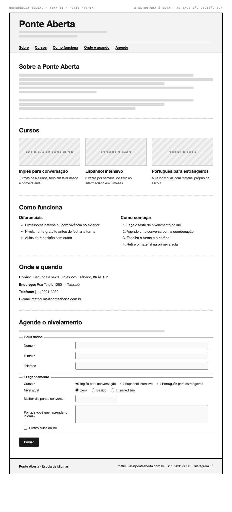

# Tema 11 · Ponte Aberta

**Escola de idiomas** · Tatuapé, São Paulo

A imagem acima mostra a página montada, só para você **ler a hierarquia**: o que é o título principal, o que é título de seção, o que é item dentro de uma seção, o que é lista e de que tipo, como os campos do formulário se agrupam. Ela não tem nenhuma tag escrita — descobrir qual tag produz cada pedaço é a prova. E não é para reproduzir o visual: a sua página não terá CSS e vai ficar diferente disso, o que é esperado.

Este é o conteúdo da sua página. Os fatos são estes; **o texto é seu** — escreva os parágrafos com as suas palavras, em português correto, no tom que combina com a organização. Os itens das listas e os dados da tabela final podem ir como estão; a apresentação e as descrições dos artigos, não — reescreva.

O que você **não** decide: a estrutura mínima exigida no enunciado. O que você decide: qual tag marca cada pedaço deste conteúdo.

---

## Quem é

Ponte Aberta é escola de idiomas em Tatuapé, São Paulo. Escreva um parágrafo de apresentação (2 a 4 frases) e um slogan curto. Invente o que faltar — ano de fundação, quem fundou, por quê — desde que seja coerente com o resto.

## Cursos — os 3 artigos

Cada item vira um `<article>` com título, um parágrafo e uma imagem.

- **Inglês para conversação** — turmas de 6 alunos, foco em falar desde a primeira aula
- **Espanhol intensivo** — 3 vezes por semana, do zero ao intermediário em 6 meses
- **Português para estrangeiros** — aula individual, com material próprio da escola

## Diferenciais — lista não ordenada

- Professores nativos ou com vivência no exterior
- Nivelamento gratuito antes de fechar a turma
- Aulas de reposição sem custo

## Como começar — lista ordenada

1. Faça o teste de nivelamento online
2. Agende uma conversa com a coordenação
3. Escolha a turma e o horário
4. Retire o material na primeira aula

## Dados — quatro parágrafos

Sem `<dl>` (não vimos em aula): um parágrafo por dado, com o rótulo em destaque no início.

| | |
| --- | --- |
| Horário | Segunda a sexta, 7h às 22h · sábado, 8h às 13h |
| Endereço | Rua Tuiuti, 1250 — Tatuapé |
| Telefone | (11) 2091-3030 |
| E-mail | matriculas@ponteaberta.com.br |

## Agende o nivelamento — formulário

A quinta seção é um formulário. Os campos fixos, iguais para todo mundo: **nome** (texto), **e-mail** e **telefone**. Os campos específicos do seu tema (sem `<select>` — não vimos em aula):

| Campo | Tipo | Opções |
| --- | --- | --- |
| Curso | escolha única, todas as opções visíveis | Inglês para conversação · Espanhol intensivo · Português para estrangeiros |
| Nível atual | escolha única, todas as opções visíveis | Zero · Básico · Intermediário |
| Melhor dia para a conversa | data | — |
| Por que você quer aprender o idioma? | texto longo | — |
| Prefiro aulas online | marcar ou não | — |

Agrupe os campos em **dois blocos** com título — "Seus dados" e "O agendamento", ou o que fizer sentido — e termine com o botão de envio. Decida você quais campos são obrigatórios. A tabela diz o *tipo de informação*; qual tag e qual `type` traduzem isso é decisão sua.

## Imagens

Três fotos, uma por artigo: sala de aula com alunos em roda, professora no quadro, recepção da escola.

Use imagens de placeholder — `https://picsum.photos/400/300` serve — ou qualquer foto livre. **O que é avaliado é o `alt`**, que precisa descrever a foto como se ela não carregasse. O `alt` é o único lugar em que você usa o texto desta seção.
