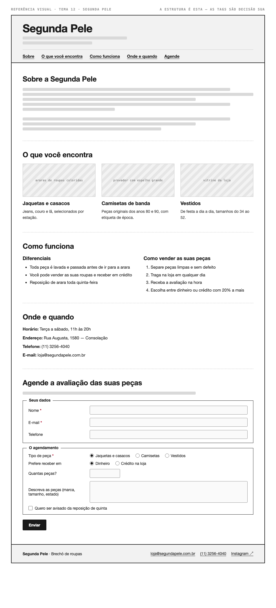

# Tema 12 · Segunda Pele

**Brechó de roupas** · Consolação, São Paulo

A imagem acima mostra a página montada, só para você **ler a hierarquia**: o que é o título principal, o que é título de seção, o que é item dentro de uma seção, o que é lista e de que tipo, como os campos do formulário se agrupam. Ela não tem nenhuma tag escrita — descobrir qual tag produz cada pedaço é a prova. E não é para reproduzir o visual: a sua página não terá CSS e vai ficar diferente disso, o que é esperado.

Este é o conteúdo da sua página. Os fatos são estes; **o texto é seu** — escreva os parágrafos com as suas palavras, em português correto, no tom que combina com a organização. Os itens das listas e os dados da tabela final podem ir como estão; a apresentação e as descrições dos artigos, não — reescreva.

O que você **não** decide: a estrutura mínima exigida no enunciado. O que você decide: qual tag marca cada pedaço deste conteúdo.

---

## Quem é

Segunda Pele é brechó de roupas em Consolação, São Paulo. Escreva um parágrafo de apresentação (2 a 4 frases) e um slogan curto. Invente o que faltar — ano de fundação, quem fundou, por quê — desde que seja coerente com o resto.

## O que você encontra — os 3 artigos

Cada item vira um `<article>` com título, um parágrafo e uma imagem.

- **Jaquetas e casacos** — jeans, couro e lã, selecionados por estação
- **Camisetas de banda** — peças originais dos anos 80 e 90, com etiqueta de época
- **Vestidos** — de festa a dia a dia, tamanhos do 34 ao 52

## Diferenciais — lista não ordenada

- Toda peça é lavada e passada antes de ir para a arara
- Você pode vender as suas roupas e receber em crédito
- Reposição de arara toda quinta-feira

## Como vender as suas peças — lista ordenada

1. Separe peças limpas e sem defeito
2. Traga na loja em qualquer dia
3. Receba a avaliação na hora
4. Escolha entre dinheiro ou crédito com 20% a mais

## Dados — quatro parágrafos

Sem `<dl>` (não vimos em aula): um parágrafo por dado, com o rótulo em destaque no início.

| | |
| --- | --- |
| Horário | Terça a sábado, 11h às 20h |
| Endereço | Rua Augusta, 1580 — Consolação |
| Telefone | (11) 3256-4040 |
| E-mail | loja@segundapele.com.br |

## Agende a avaliação das suas peças — formulário

A quinta seção é um formulário. Os campos fixos, iguais para todo mundo: **nome** (texto), **e-mail** e **telefone**. Os campos específicos do seu tema (sem `<select>` — não vimos em aula):

| Campo | Tipo | Opções |
| --- | --- | --- |
| Tipo de peça | escolha única, todas as opções visíveis | Jaquetas e casacos · Camisetas · Vestidos |
| Prefere receber em | escolha única, todas as opções visíveis | Dinheiro · Crédito na loja |
| Quantas peças? | número | — |
| Descreva as peças (marca, tamanho, estado) | texto longo | — |
| Quero ser avisado da reposição de quinta | marcar ou não | — |

Agrupe os campos em **dois blocos** com título — "Seus dados" e "O agendamento", ou o que fizer sentido — e termine com o botão de envio. Decida você quais campos são obrigatórios. A tabela diz o *tipo de informação*; qual tag e qual `type` traduzem isso é decisão sua.

## Imagens

Três fotos, uma por artigo: araras de roupas coloridas, provador com espelho grande, vitrine da loja.

Use imagens de placeholder — `https://picsum.photos/400/300` serve — ou qualquer foto livre. **O que é avaliado é o `alt`**, que precisa descrever a foto como se ela não carregasse. O `alt` é o único lugar em que você usa o texto desta seção.
