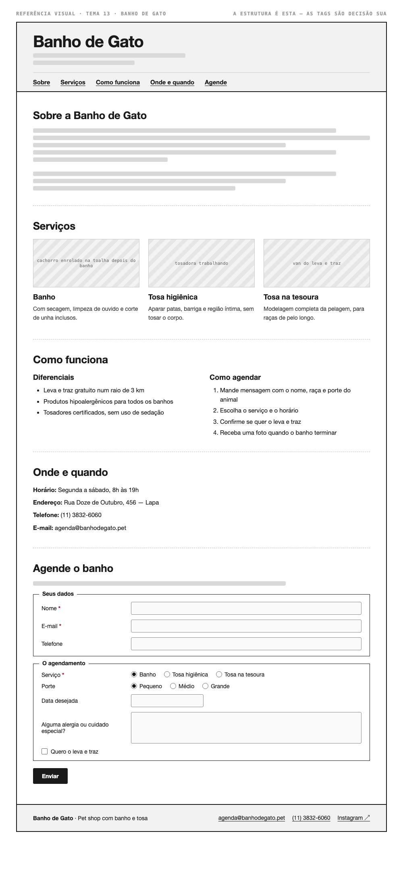

# Tema 13 · Banho de Gato

**Pet shop com banho e tosa** · Lapa, São Paulo

A imagem acima mostra a página montada, só para você **ler a hierarquia**: o que é o título principal, o que é título de seção, o que é item dentro de uma seção, o que é lista e de que tipo, como os campos do formulário se agrupam. Ela não tem nenhuma tag escrita — descobrir qual tag produz cada pedaço é a prova. E não é para reproduzir o visual: a sua página não terá CSS e vai ficar diferente disso, o que é esperado.

Este é o conteúdo da sua página. Os fatos são estes; **o texto é seu** — escreva os parágrafos com as suas palavras, em português correto, no tom que combina com a organização. Os itens das listas e os dados da tabela final podem ir como estão; a apresentação e as descrições dos artigos, não — reescreva.

O que você **não** decide: a estrutura mínima exigida no enunciado. O que você decide: qual tag marca cada pedaço deste conteúdo.

---

## Quem é

Banho de Gato é pet shop com banho e tosa em Lapa, São Paulo. Escreva um parágrafo de apresentação (2 a 4 frases) e um slogan curto. Invente o que faltar — ano de fundação, quem fundou, por quê — desde que seja coerente com o resto.

## Serviços — os 3 artigos

Cada item vira um `<article>` com título, um parágrafo e uma imagem.

- **Banho** — com secagem, limpeza de ouvido e corte de unha inclusos
- **Tosa higiênica** — aparar patas, barriga e região íntima, sem tosar o corpo
- **Tosa na tesoura** — modelagem completa da pelagem, para raças de pelo longo

## Diferenciais — lista não ordenada

- Leva e traz gratuito num raio de 3 km
- Produtos hipoalergênicos para todos os banhos
- Tosadores certificados, sem uso de sedação

## Como agendar — lista ordenada

1. Mande mensagem com o nome, raça e porte do animal
2. Escolha o serviço e o horário
3. Confirme se quer o leva e traz
4. Receba uma foto quando o banho terminar

## Dados — quatro parágrafos

Sem `<dl>` (não vimos em aula): um parágrafo por dado, com o rótulo em destaque no início.

| | |
| --- | --- |
| Horário | Segunda a sábado, 8h às 19h |
| Endereço | Rua Doze de Outubro, 456 — Lapa |
| Telefone | (11) 3832-6060 |
| E-mail | agenda@banhodegato.pet |

## Agende o banho — formulário

A quinta seção é um formulário. Os campos fixos, iguais para todo mundo: **nome** (texto), **e-mail** e **telefone**. Os campos específicos do seu tema (sem `<select>` — não vimos em aula):

| Campo | Tipo | Opções |
| --- | --- | --- |
| Serviço | escolha única, todas as opções visíveis | Banho · Tosa higiênica · Tosa na tesoura |
| Porte | escolha única, todas as opções visíveis | Pequeno · Médio · Grande |
| Data desejada | data | — |
| Alguma alergia ou cuidado especial? | texto longo | — |
| Quero o leva e traz | marcar ou não | — |

Agrupe os campos em **dois blocos** com título — "Seus dados" e "O agendamento", ou o que fizer sentido — e termine com o botão de envio. Decida você quais campos são obrigatórios. A tabela diz o *tipo de informação*; qual tag e qual `type` traduzem isso é decisão sua.

## Imagens

Três fotos, uma por artigo: cachorro enrolado na toalha depois do banho, tosadora trabalhando, van do leva e traz.

Use imagens de placeholder — `https://picsum.photos/400/300` serve — ou qualquer foto livre. **O que é avaliado é o `alt`**, que precisa descrever a foto como se ela não carregasse. O `alt` é o único lugar em que você usa o texto desta seção.
