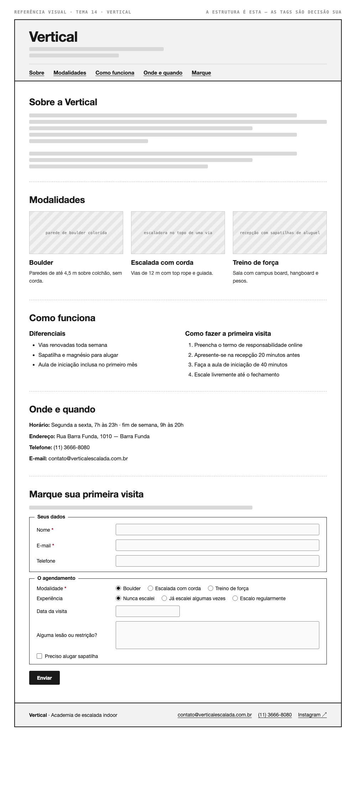

# Tema 14 · Vertical

**Academia de escalada indoor** · Barra Funda, São Paulo

A imagem acima mostra a página montada, só para você **ler a hierarquia**: o que é o título principal, o que é título de seção, o que é item dentro de uma seção, o que é lista e de que tipo, como os campos do formulário se agrupam. Ela não tem nenhuma tag escrita — descobrir qual tag produz cada pedaço é a prova. E não é para reproduzir o visual: a sua página não terá CSS e vai ficar diferente disso, o que é esperado.

Este é o conteúdo da sua página. Os fatos são estes; **o texto é seu** — escreva os parágrafos com as suas palavras, em português correto, no tom que combina com a organização. Os itens das listas e os dados da tabela final podem ir como estão; a apresentação e as descrições dos artigos, não — reescreva.

O que você **não** decide: a estrutura mínima exigida no enunciado. O que você decide: qual tag marca cada pedaço deste conteúdo.

---

## Quem é

Vertical é academia de escalada indoor em Barra Funda, São Paulo. Escreva um parágrafo de apresentação (2 a 4 frases) e um slogan curto. Invente o que faltar — ano de fundação, quem fundou, por quê — desde que seja coerente com o resto.

## Modalidades — os 3 artigos

Cada item vira um `<article>` com título, um parágrafo e uma imagem.

- **Boulder** — paredes de até 4,5 m sobre colchão, sem corda
- **Escalada com corda** — vias de 12 m com top rope e guiada
- **Treino de força** — sala com campus board, hangboard e pesos

## Diferenciais — lista não ordenada

- Vias renovadas toda semana
- Sapatilha e magnésio para alugar
- Aula de iniciação inclusa no primeiro mês

## Como fazer a primeira visita — lista ordenada

1. Preencha o termo de responsabilidade online
2. Apresente-se na recepção 20 minutos antes
3. Faça a aula de iniciação de 40 minutos
4. Escale livremente até o fechamento

## Dados — quatro parágrafos

Sem `<dl>` (não vimos em aula): um parágrafo por dado, com o rótulo em destaque no início.

| | |
| --- | --- |
| Horário | Segunda a sexta, 7h às 23h · fim de semana, 9h às 20h |
| Endereço | Rua Barra Funda, 1010 — Barra Funda |
| Telefone | (11) 3666-8080 |
| E-mail | contato@verticalescalada.com.br |

## Marque sua primeira visita — formulário

A quinta seção é um formulário. Os campos fixos, iguais para todo mundo: **nome** (texto), **e-mail** e **telefone**. Os campos específicos do seu tema (sem `<select>` — não vimos em aula):

| Campo | Tipo | Opções |
| --- | --- | --- |
| Modalidade | escolha única, todas as opções visíveis | Boulder · Escalada com corda · Treino de força |
| Experiência | escolha única, todas as opções visíveis | Nunca escalei · Já escalei algumas vezes · Escalo regularmente |
| Data da visita | data | — |
| Alguma lesão ou restrição? | texto longo | — |
| Preciso alugar sapatilha | marcar ou não | — |

Agrupe os campos em **dois blocos** com título — "Seus dados" e "O agendamento", ou o que fizer sentido — e termine com o botão de envio. Decida você quais campos são obrigatórios. A tabela diz o *tipo de informação*; qual tag e qual `type` traduzem isso é decisão sua.

## Imagens

Três fotos, uma por artigo: parede de boulder colorida, escaladora no topo de uma via, recepção com sapatilhas de aluguel.

Use imagens de placeholder — `https://picsum.photos/400/300` serve — ou qualquer foto livre. **O que é avaliado é o `alt`**, que precisa descrever a foto como se ela não carregasse. O `alt` é o único lugar em que você usa o texto desta seção.
