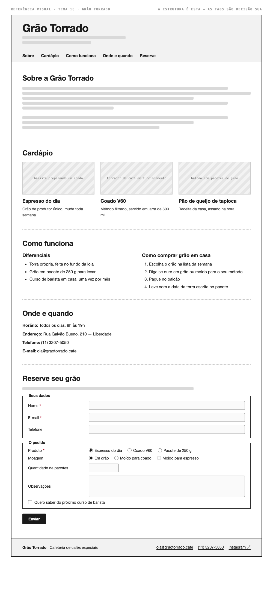

# Tema 16 · Grão Torrado

**Cafeteria de cafés especiais** · Liberdade, São Paulo

A imagem acima mostra a página montada, só para você **ler a hierarquia**: o que é o título principal, o que é título de seção, o que é item dentro de uma seção, o que é lista e de que tipo, como os campos do formulário se agrupam. Ela não tem nenhuma tag escrita — descobrir qual tag produz cada pedaço é a prova. E não é para reproduzir o visual: a sua página não terá CSS e vai ficar diferente disso, o que é esperado.

Este é o conteúdo da sua página. Os fatos são estes; **o texto é seu** — escreva os parágrafos com as suas palavras, em português correto, no tom que combina com a organização. Os itens das listas e os dados da tabela final podem ir como estão; a apresentação e as descrições dos artigos, não — reescreva.

O que você **não** decide: a estrutura mínima exigida no enunciado. O que você decide: qual tag marca cada pedaço deste conteúdo.

---

## Quem é

Grão Torrado é cafeteria de cafés especiais em Liberdade, São Paulo. Escreva um parágrafo de apresentação (2 a 4 frases) e um slogan curto. Invente o que faltar — ano de fundação, quem fundou, por quê — desde que seja coerente com o resto.

## Cardápio — os 3 artigos

Cada item vira um `<article>` com título, um parágrafo e uma imagem.

- **Espresso do dia** — grão de produtor único, muda toda semana
- **Coado V60** — método filtrado, servido em jarra de 300 ml
- **Pão de queijo de tapioca** — receita da casa, assado na hora

## Diferenciais — lista não ordenada

- Torra própria, feita no fundo da loja
- Grão em pacote de 250 g para levar
- Curso de barista em casa, uma vez por mês

## Como comprar grão em casa — lista ordenada

1. Escolha o grão na lista da semana
2. Diga se quer em grão ou moído para o seu método
3. Pague no balcão
4. Leve com a data da torra escrita no pacote

## Dados — quatro parágrafos

Sem `<dl>` (não vimos em aula): um parágrafo por dado, com o rótulo em destaque no início.

| | |
| --- | --- |
| Horário | Todos os dias, 8h às 19h |
| Endereço | Rua Galvão Bueno, 210 — Liberdade |
| Telefone | (11) 3207-5050 |
| E-mail | ola@graotorrado.cafe |

## Reserve seu grão — formulário

A quinta seção é um formulário. Os campos fixos, iguais para todo mundo: **nome** (texto), **e-mail** e **telefone**. Os campos específicos do seu tema (sem `<select>` — não vimos em aula):

| Campo | Tipo | Opções |
| --- | --- | --- |
| Produto | escolha única, todas as opções visíveis | Espresso do dia · Coado V60 · Pacote de 250 g |
| Moagem | escolha única, todas as opções visíveis | Em grão · Moído para coado · Moído para espresso |
| Quantidade de pacotes | número | — |
| Observações | texto longo | — |
| Quero saber do próximo curso de barista | marcar ou não | — |

Agrupe os campos em **dois blocos** com título — "Seus dados" e "O agendamento", ou o que fizer sentido — e termine com o botão de envio. Decida você quais campos são obrigatórios. A tabela diz o *tipo de informação*; qual tag e qual `type` traduzem isso é decisão sua.

## Imagens

Três fotos, uma por artigo: barista preparando um coado, torrador de café em funcionamento, balcão com pacotes de grão.

Use imagens de placeholder — `https://picsum.photos/400/300` serve — ou qualquer foto livre. **O que é avaliado é o `alt`**, que precisa descrever a foto como se ela não carregasse. O `alt` é o único lugar em que você usa o texto desta seção.
