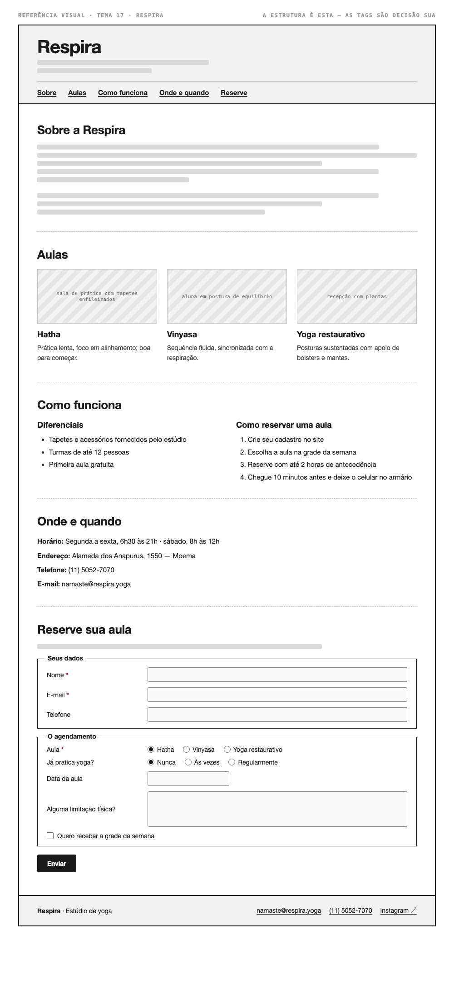

# Tema 17 · Respira

**Estúdio de yoga** · Moema, São Paulo

A imagem acima mostra a página montada, só para você **ler a hierarquia**: o que é o título principal, o que é título de seção, o que é item dentro de uma seção, o que é lista e de que tipo, como os campos do formulário se agrupam. Ela não tem nenhuma tag escrita — descobrir qual tag produz cada pedaço é a prova. E não é para reproduzir o visual: a sua página não terá CSS e vai ficar diferente disso, o que é esperado.

Este é o conteúdo da sua página. Os fatos são estes; **o texto é seu** — escreva os parágrafos com as suas palavras, em português correto, no tom que combina com a organização. Os itens das listas e os dados da tabela final podem ir como estão; a apresentação e as descrições dos artigos, não — reescreva.

O que você **não** decide: a estrutura mínima exigida no enunciado. O que você decide: qual tag marca cada pedaço deste conteúdo.

---

## Quem é

Respira é estúdio de yoga em Moema, São Paulo. Escreva um parágrafo de apresentação (2 a 4 frases) e um slogan curto. Invente o que faltar — ano de fundação, quem fundou, por quê — desde que seja coerente com o resto.

## Aulas — os 3 artigos

Cada item vira um `<article>` com título, um parágrafo e uma imagem.

- **Hatha** — prática lenta, foco em alinhamento; boa para começar
- **Vinyasa** — sequência fluida, sincronizada com a respiração
- **Yoga restaurativo** — posturas sustentadas com apoio de bolsters e mantas

## Diferenciais — lista não ordenada

- Tapetes e acessórios fornecidos pelo estúdio
- Turmas de até 12 pessoas
- Primeira aula gratuita

## Como reservar uma aula — lista ordenada

1. Crie seu cadastro no site
2. Escolha a aula na grade da semana
3. Reserve com até 2 horas de antecedência
4. Chegue 10 minutos antes e deixe o celular no armário

## Dados — quatro parágrafos

Sem `<dl>` (não vimos em aula): um parágrafo por dado, com o rótulo em destaque no início.

| | |
| --- | --- |
| Horário | Segunda a sexta, 6h30 às 21h · sábado, 8h às 12h |
| Endereço | Alameda dos Anapurus, 1550 — Moema |
| Telefone | (11) 5052-7070 |
| E-mail | namaste@respira.yoga |

## Reserve sua aula — formulário

A quinta seção é um formulário. Os campos fixos, iguais para todo mundo: **nome** (texto), **e-mail** e **telefone**. Os campos específicos do seu tema (sem `<select>` — não vimos em aula):

| Campo | Tipo | Opções |
| --- | --- | --- |
| Aula | escolha única, todas as opções visíveis | Hatha · Vinyasa · Yoga restaurativo |
| Já pratica yoga? | escolha única, todas as opções visíveis | Nunca · Às vezes · Regularmente |
| Data da aula | data | — |
| Alguma limitação física? | texto longo | — |
| Quero receber a grade da semana | marcar ou não | — |

Agrupe os campos em **dois blocos** com título — "Seus dados" e "O agendamento", ou o que fizer sentido — e termine com o botão de envio. Decida você quais campos são obrigatórios. A tabela diz o *tipo de informação*; qual tag e qual `type` traduzem isso é decisão sua.

## Imagens

Três fotos, uma por artigo: sala de prática com tapetes enfileirados, aluna em postura de equilíbrio, recepção com plantas.

Use imagens de placeholder — `https://picsum.photos/400/300` serve — ou qualquer foto livre. **O que é avaliado é o `alt`**, que precisa descrever a foto como se ela não carregasse. O `alt` é o único lugar em que você usa o texto desta seção.
