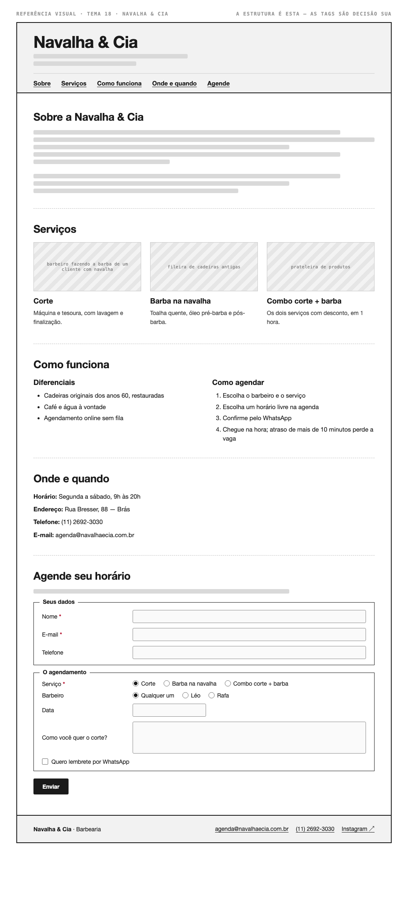

# Tema 18 · Navalha & Cia

**Barbearia** · Brás, São Paulo

A imagem acima mostra a página montada, só para você **ler a hierarquia**: o que é o título principal, o que é título de seção, o que é item dentro de uma seção, o que é lista e de que tipo, como os campos do formulário se agrupam. Ela não tem nenhuma tag escrita — descobrir qual tag produz cada pedaço é a prova. E não é para reproduzir o visual: a sua página não terá CSS e vai ficar diferente disso, o que é esperado.

Este é o conteúdo da sua página. Os fatos são estes; **o texto é seu** — escreva os parágrafos com as suas palavras, em português correto, no tom que combina com a organização. Os itens das listas e os dados da tabela final podem ir como estão; a apresentação e as descrições dos artigos, não — reescreva.

O que você **não** decide: a estrutura mínima exigida no enunciado. O que você decide: qual tag marca cada pedaço deste conteúdo.

---

## Quem é

Navalha & Cia é barbearia em Brás, São Paulo. Escreva um parágrafo de apresentação (2 a 4 frases) e um slogan curto. Invente o que faltar — ano de fundação, quem fundou, por quê — desde que seja coerente com o resto.

## Serviços — os 3 artigos

Cada item vira um `<article>` com título, um parágrafo e uma imagem.

- **Corte** — máquina e tesoura, com lavagem e finalização
- **Barba na navalha** — toalha quente, óleo pré-barba e pós-barba
- **Combo corte + barba** — os dois serviços com desconto, em 1 hora

## Diferenciais — lista não ordenada

- Cadeiras originais dos anos 60, restauradas
- Café e água à vontade
- Agendamento online sem fila

## Como agendar — lista ordenada

1. Escolha o barbeiro e o serviço
2. Escolha um horário livre na agenda
3. Confirme pelo WhatsApp
4. Chegue na hora; atraso de mais de 10 minutos perde a vaga

## Dados — quatro parágrafos

Sem `<dl>` (não vimos em aula): um parágrafo por dado, com o rótulo em destaque no início.

| | |
| --- | --- |
| Horário | Segunda a sábado, 9h às 20h |
| Endereço | Rua Bresser, 88 — Brás |
| Telefone | (11) 2692-3030 |
| E-mail | agenda@navalhaecia.com.br |

## Agende seu horário — formulário

A quinta seção é um formulário. Os campos fixos, iguais para todo mundo: **nome** (texto), **e-mail** e **telefone**. Os campos específicos do seu tema (sem `<select>` — não vimos em aula):

| Campo | Tipo | Opções |
| --- | --- | --- |
| Serviço | escolha única, todas as opções visíveis | Corte · Barba na navalha · Combo corte + barba |
| Barbeiro | escolha única, todas as opções visíveis | Qualquer um · Léo · Rafa |
| Data | data | — |
| Como você quer o corte? | texto longo | — |
| Quero lembrete por WhatsApp | marcar ou não | — |

Agrupe os campos em **dois blocos** com título — "Seus dados" e "O agendamento", ou o que fizer sentido — e termine com o botão de envio. Decida você quais campos são obrigatórios. A tabela diz o *tipo de informação*; qual tag e qual `type` traduzem isso é decisão sua.

## Imagens

Três fotos, uma por artigo: barbeiro fazendo a barba de um cliente com navalha, fileira de cadeiras antigas, prateleira de produtos.

Use imagens de placeholder — `https://picsum.photos/400/300` serve — ou qualquer foto livre. **O que é avaliado é o `alt`**, que precisa descrever a foto como se ela não carregasse. O `alt` é o único lugar em que você usa o texto desta seção.
