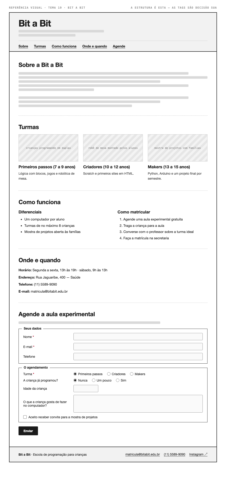

# Tema 19 · Bit a Bit

**Escola de programação para crianças** · Saúde, São Paulo

A imagem acima mostra a página montada, só para você **ler a hierarquia**: o que é o título principal, o que é título de seção, o que é item dentro de uma seção, o que é lista e de que tipo, como os campos do formulário se agrupam. Ela não tem nenhuma tag escrita — descobrir qual tag produz cada pedaço é a prova. E não é para reproduzir o visual: a sua página não terá CSS e vai ficar diferente disso, o que é esperado.

Este é o conteúdo da sua página. Os fatos são estes; **o texto é seu** — escreva os parágrafos com as suas palavras, em português correto, no tom que combina com a organização. Os itens das listas e os dados da tabela final podem ir como estão; a apresentação e as descrições dos artigos, não — reescreva.

O que você **não** decide: a estrutura mínima exigida no enunciado. O que você decide: qual tag marca cada pedaço deste conteúdo.

---

## Quem é

Bit a Bit é escola de programação para crianças em Saúde, São Paulo. Escreva um parágrafo de apresentação (2 a 4 frases) e um slogan curto. Invente o que faltar — ano de fundação, quem fundou, por quê — desde que seja coerente com o resto.

## Turmas — os 3 artigos

Cada item vira um `<article>` com título, um parágrafo e uma imagem.

- **Primeiros passos (7 a 9 anos)** — lógica com blocos, jogos e robótica de mesa
- **Criadores (10 a 12 anos)** — Scratch e primeiros sites em HTML
- **Makers (13 a 15 anos)** — Python, Arduino e um projeto final por semestre

## Diferenciais — lista não ordenada

- Um computador por aluno
- Turmas de no máximo 8 crianças
- Mostra de projetos aberta às famílias

## Como matricular — lista ordenada

1. Agende uma aula experimental gratuita
2. Traga a criança para a aula
3. Converse com o professor sobre a turma ideal
4. Faça a matrícula na secretaria

## Dados — quatro parágrafos

Sem `<dl>` (não vimos em aula): um parágrafo por dado, com o rótulo em destaque no início.

| | |
| --- | --- |
| Horário | Segunda a sexta, 13h às 19h · sábado, 9h às 13h |
| Endereço | Rua Jaguaribe, 400 — Saúde |
| Telefone | (11) 5589-9090 |
| E-mail | matricula@bitabit.edu.br |

## Agende a aula experimental — formulário

A quinta seção é um formulário. Os campos fixos, iguais para todo mundo: **nome** (texto), **e-mail** e **telefone**. Os campos específicos do seu tema (sem `<select>` — não vimos em aula):

| Campo | Tipo | Opções |
| --- | --- | --- |
| Turma | escolha única, todas as opções visíveis | Primeiros passos · Criadores · Makers |
| A criança já programou? | escolha única, todas as opções visíveis | Nunca · Um pouco · Sim |
| Idade da criança | número | — |
| O que a criança gosta de fazer no computador? | texto longo | — |
| Aceito receber convite para a mostra de projetos | marcar ou não | — |

Agrupe os campos em **dois blocos** com título — "Seus dados" e "O agendamento", ou o que fizer sentido — e termine com o botão de envio. Decida você quais campos são obrigatórios. A tabela diz o *tipo de informação*; qual tag e qual `type` traduzem isso é decisão sua.

## Imagens

Três fotos, uma por artigo: crianças programando em duplas, robô de mesa montado pelos alunos, mostra de projetos com famílias.

Use imagens de placeholder — `https://picsum.photos/400/300` serve — ou qualquer foto livre. **O que é avaliado é o `alt`**, que precisa descrever a foto como se ela não carregasse. O `alt` é o único lugar em que você usa o texto desta seção.
