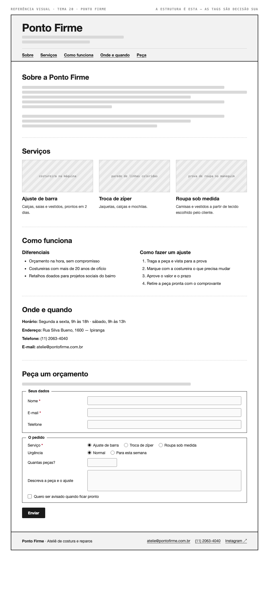

# Tema 20 · Ponto Firme

**Ateliê de costura e reparos** · Ipiranga, São Paulo

A imagem acima mostra a página montada, só para você **ler a hierarquia**: o que é o título principal, o que é título de seção, o que é item dentro de uma seção, o que é lista e de que tipo, como os campos do formulário se agrupam. Ela não tem nenhuma tag escrita — descobrir qual tag produz cada pedaço é a prova. E não é para reproduzir o visual: a sua página não terá CSS e vai ficar diferente disso, o que é esperado.

Este é o conteúdo da sua página. Os fatos são estes; **o texto é seu** — escreva os parágrafos com as suas palavras, em português correto, no tom que combina com a organização. Os itens das listas e os dados da tabela final podem ir como estão; a apresentação e as descrições dos artigos, não — reescreva.

O que você **não** decide: a estrutura mínima exigida no enunciado. O que você decide: qual tag marca cada pedaço deste conteúdo.

---

## Quem é

Ponto Firme é ateliê de costura e reparos em Ipiranga, São Paulo. Escreva um parágrafo de apresentação (2 a 4 frases) e um slogan curto. Invente o que faltar — ano de fundação, quem fundou, por quê — desde que seja coerente com o resto.

## Serviços — os 3 artigos

Cada item vira um `<article>` com título, um parágrafo e uma imagem.

- **Ajuste de barra** — calças, saias e vestidos, prontos em 2 dias
- **Troca de zíper** — jaquetas, calças e mochilas
- **Roupa sob medida** — camisas e vestidos a partir de tecido escolhido pelo cliente

## Diferenciais — lista não ordenada

- Orçamento na hora, sem compromisso
- Costureiras com mais de 20 anos de ofício
- Retalhos doados para projetos sociais do bairro

## Como fazer um ajuste — lista ordenada

1. Traga a peça e vista para a prova
2. Marque com a costureira o que precisa mudar
3. Aprove o valor e o prazo
4. Retire a peça pronta com o comprovante

## Dados — quatro parágrafos

Sem `<dl>` (não vimos em aula): um parágrafo por dado, com o rótulo em destaque no início.

| | |
| --- | --- |
| Horário | Segunda a sexta, 9h às 18h · sábado, 9h às 13h |
| Endereço | Rua Silva Bueno, 1600 — Ipiranga |
| Telefone | (11) 2063-4040 |
| E-mail | atelie@pontofirme.com.br |

## Peça um orçamento — formulário

A quinta seção é um formulário. Os campos fixos, iguais para todo mundo: **nome** (texto), **e-mail** e **telefone**. Os campos específicos do seu tema (sem `<select>` — não vimos em aula):

| Campo | Tipo | Opções |
| --- | --- | --- |
| Serviço | escolha única, todas as opções visíveis | Ajuste de barra · Troca de zíper · Roupa sob medida |
| Urgência | escolha única, todas as opções visíveis | Normal · Para esta semana |
| Quantas peças? | número | — |
| Descreva a peça e o ajuste | texto longo | — |
| Quero ser avisado quando ficar pronto | marcar ou não | — |

Agrupe os campos em **dois blocos** com título — "Seus dados" e "O pedido", ou o que fizer sentido — e termine com o botão de envio. Decida você quais campos são obrigatórios. A tabela diz o *tipo de informação*; qual tag e qual `type` traduzem isso é decisão sua.

## Imagens

Três fotos, uma por artigo: costureira na máquina, parede de linhas coloridas, prova de roupa no manequim.

Use imagens de placeholder — `https://picsum.photos/400/300` serve — ou qualquer foto livre. **O que é avaliado é o `alt`**, que precisa descrever a foto como se ela não carregasse. O `alt` é o único lugar em que você usa o texto desta seção.
