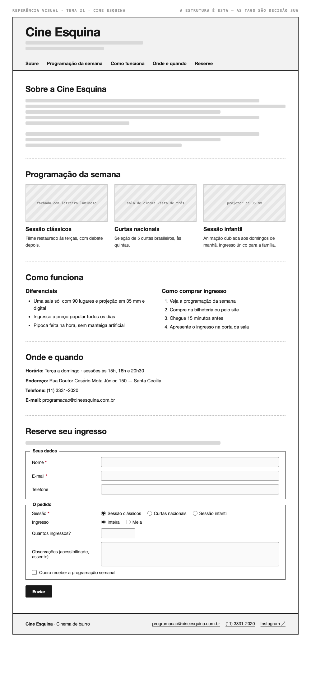

# Tema 21 · Cine Esquina

**Cinema de bairro** · Santa Cecília, São Paulo

A imagem acima mostra a página montada, só para você **ler a hierarquia**: o que é o título principal, o que é título de seção, o que é item dentro de uma seção, o que é lista e de que tipo, como os campos do formulário se agrupam. Ela não tem nenhuma tag escrita — descobrir qual tag produz cada pedaço é a prova. E não é para reproduzir o visual: a sua página não terá CSS e vai ficar diferente disso, o que é esperado.

Este é o conteúdo da sua página. Os fatos são estes; **o texto é seu** — escreva os parágrafos com as suas palavras, em português correto, no tom que combina com a organização. Os itens das listas e os dados da tabela final podem ir como estão; a apresentação e as descrições dos artigos, não — reescreva.

O que você **não** decide: a estrutura mínima exigida no enunciado. O que você decide: qual tag marca cada pedaço deste conteúdo.

---

## Quem é

Cine Esquina é cinema de bairro em Santa Cecília, São Paulo. Escreva um parágrafo de apresentação (2 a 4 frases) e um slogan curto. Invente o que faltar — ano de fundação, quem fundou, por quê — desde que seja coerente com o resto.

## Programação da semana — os 3 artigos

Cada item vira um `<article>` com título, um parágrafo e uma imagem.

- **Sessão clássicos** — filme restaurado às terças, com debate depois
- **Curtas nacionais** — seleção de 5 curtas brasileiros, às quintas
- **Sessão infantil** — animação dublada aos domingos de manhã, ingresso único para a família

## Diferenciais — lista não ordenada

- Uma sala só, com 90 lugares e projeção em 35 mm e digital
- Ingresso a preço popular todos os dias
- Pipoca feita na hora, sem manteiga artificial

## Como comprar ingresso — lista ordenada

1. Veja a programação da semana
2. Compre na bilheteria ou pelo site
3. Chegue 15 minutos antes
4. Apresente o ingresso na porta da sala

## Dados — quatro parágrafos

Sem `<dl>` (não vimos em aula): um parágrafo por dado, com o rótulo em destaque no início.

| | |
| --- | --- |
| Horário | Terça a domingo · sessões às 15h, 18h e 20h30 |
| Endereço | Rua Doutor Cesário Mota Júnior, 150 — Santa Cecília |
| Telefone | (11) 3331-2020 |
| E-mail | programacao@cineesquina.com.br |

## Reserve seu ingresso — formulário

A quinta seção é um formulário. Os campos fixos, iguais para todo mundo: **nome** (texto), **e-mail** e **telefone**. Os campos específicos do seu tema (sem `<select>` — não vimos em aula):

| Campo | Tipo | Opções |
| --- | --- | --- |
| Sessão | escolha única, todas as opções visíveis | Sessão clássicos · Curtas nacionais · Sessão infantil |
| Ingresso | escolha única, todas as opções visíveis | Inteira · Meia |
| Quantos ingressos? | número | — |
| Observações (acessibilidade, assento) | texto longo | — |
| Quero receber a programação semanal | marcar ou não | — |

Agrupe os campos em **dois blocos** com título — "Seus dados" e "O agendamento", ou o que fizer sentido — e termine com o botão de envio. Decida você quais campos são obrigatórios. A tabela diz o *tipo de informação*; qual tag e qual `type` traduzem isso é decisão sua.

## Imagens

Três fotos, uma por artigo: fachada com letreiro luminoso, sala de cinema vista de trás, projetor de 35 mm.

Use imagens de placeholder — `https://picsum.photos/400/300` serve — ou qualquer foto livre. **O que é avaliado é o `alt`**, que precisa descrever a foto como se ela não carregasse. O `alt` é o único lugar em que você usa o texto desta seção.
