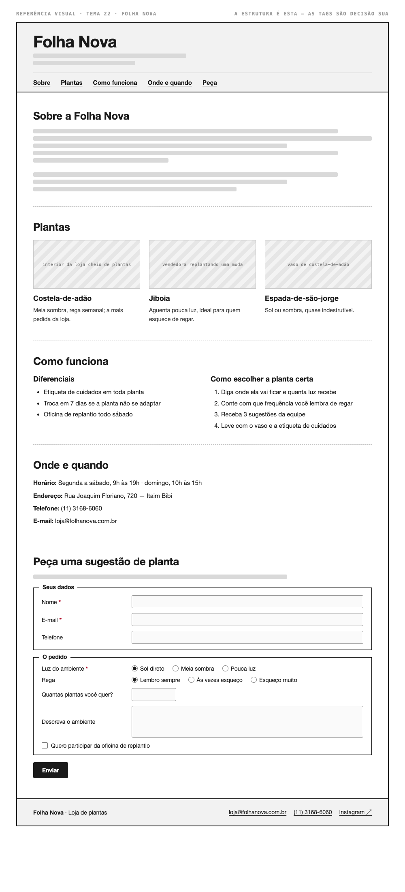

# Tema 22 · Folha Nova

**Loja de plantas** · Itaim Bibi, São Paulo

A imagem acima mostra a página montada, só para você **ler a hierarquia**: o que é o título principal, o que é título de seção, o que é item dentro de uma seção, o que é lista e de que tipo, como os campos do formulário se agrupam. Ela não tem nenhuma tag escrita — descobrir qual tag produz cada pedaço é a prova. E não é para reproduzir o visual: a sua página não terá CSS e vai ficar diferente disso, o que é esperado.

Este é o conteúdo da sua página. Os fatos são estes; **o texto é seu** — escreva os parágrafos com as suas palavras, em português correto, no tom que combina com a organização. Os itens das listas e os dados da tabela final podem ir como estão; a apresentação e as descrições dos artigos, não — reescreva.

O que você **não** decide: a estrutura mínima exigida no enunciado. O que você decide: qual tag marca cada pedaço deste conteúdo.

---

## Quem é

Folha Nova é loja de plantas em Itaim Bibi, São Paulo. Escreva um parágrafo de apresentação (2 a 4 frases) e um slogan curto. Invente o que faltar — ano de fundação, quem fundou, por quê — desde que seja coerente com o resto.

## Plantas — os 3 artigos

Cada item vira um `<article>` com título, um parágrafo e uma imagem.

- **Costela-de-adão** — meia sombra, rega semanal; a mais pedida da loja
- **Jiboia** — aguenta pouca luz, ideal para quem esquece de regar
- **Espada-de-são-jorge** — sol ou sombra, quase indestrutível

## Diferenciais — lista não ordenada

- Etiqueta de cuidados em toda planta
- Troca em 7 dias se a planta não se adaptar
- Oficina de replantio todo sábado

## Como escolher a planta certa — lista ordenada

1. Diga onde ela vai ficar e quanta luz recebe
2. Conte com que frequência você lembra de regar
3. Receba 3 sugestões da equipe
4. Leve com o vaso e a etiqueta de cuidados

## Dados — quatro parágrafos

Sem `<dl>` (não vimos em aula): um parágrafo por dado, com o rótulo em destaque no início.

| | |
| --- | --- |
| Horário | Segunda a sábado, 9h às 19h · domingo, 10h às 15h |
| Endereço | Rua Joaquim Floriano, 720 — Itaim Bibi |
| Telefone | (11) 3168-6060 |
| E-mail | loja@folhanova.com.br |

## Peça uma sugestão de planta — formulário

A quinta seção é um formulário. Os campos fixos, iguais para todo mundo: **nome** (texto), **e-mail** e **telefone**. Os campos específicos do seu tema (sem `<select>` — não vimos em aula):

| Campo | Tipo | Opções |
| --- | --- | --- |
| Luz do ambiente | escolha única, todas as opções visíveis | Sol direto · Meia sombra · Pouca luz |
| Rega | escolha única, todas as opções visíveis | Lembro sempre · Às vezes esqueço · Esqueço muito |
| Quantas plantas você quer? | número | — |
| Descreva o ambiente | texto longo | — |
| Quero participar da oficina de replantio | marcar ou não | — |

Agrupe os campos em **dois blocos** com título — "Seus dados" e "O pedido", ou o que fizer sentido — e termine com o botão de envio. Decida você quais campos são obrigatórios. A tabela diz o *tipo de informação*; qual tag e qual `type` traduzem isso é decisão sua.

## Imagens

Três fotos, uma por artigo: interior da loja cheio de plantas, vendedora replantando uma muda, vaso de costela-de-adão.

Use imagens de placeholder — `https://picsum.photos/400/300` serve — ou qualquer foto livre. **O que é avaliado é o `alt`**, que precisa descrever a foto como se ela não carregasse. O `alt` é o único lugar em que você usa o texto desta seção.
