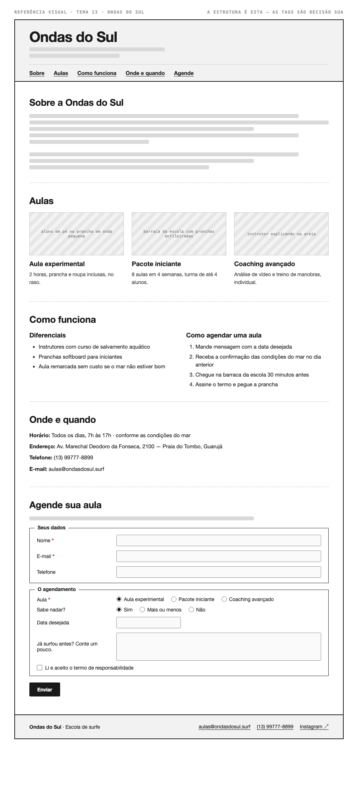

# Tema 23 · Ondas do Sul

**Escola de surfe** · Praia do Tombo, Guarujá

A imagem acima mostra a página montada, só para você **ler a hierarquia**: o que é o título principal, o que é título de seção, o que é item dentro de uma seção, o que é lista e de que tipo, como os campos do formulário se agrupam. Ela não tem nenhuma tag escrita — descobrir qual tag produz cada pedaço é a prova. E não é para reproduzir o visual: a sua página não terá CSS e vai ficar diferente disso, o que é esperado.

Este é o conteúdo da sua página. Os fatos são estes; **o texto é seu** — escreva os parágrafos com as suas palavras, em português correto, no tom que combina com a organização. Os itens das listas e os dados da tabela final podem ir como estão; a apresentação e as descrições dos artigos, não — reescreva.

O que você **não** decide: a estrutura mínima exigida no enunciado. O que você decide: qual tag marca cada pedaço deste conteúdo.

---

## Quem é

Ondas do Sul é escola de surfe em Praia do Tombo, Guarujá. Escreva um parágrafo de apresentação (2 a 4 frases) e um slogan curto. Invente o que faltar — ano de fundação, quem fundou, por quê — desde que seja coerente com o resto.

## Aulas — os 3 artigos

Cada item vira um `<article>` com título, um parágrafo e uma imagem.

- **Aula experimental** — 2 horas, prancha e roupa inclusas, no raso
- **Pacote iniciante** — 8 aulas em 4 semanas, turma de até 4 alunos
- **Coaching avançado** — análise de vídeo e treino de manobras, individual

## Diferenciais — lista não ordenada

- Instrutores com curso de salvamento aquático
- Pranchas softboard para iniciantes
- Aula remarcada sem custo se o mar não estiver bom

## Como agendar uma aula — lista ordenada

1. Mande mensagem com a data desejada
2. Receba a confirmação das condições do mar no dia anterior
3. Chegue na barraca da escola 30 minutos antes
4. Assine o termo e pegue a prancha

## Dados — quatro parágrafos

Sem `<dl>` (não vimos em aula): um parágrafo por dado, com o rótulo em destaque no início.

| | |
| --- | --- |
| Horário | Todos os dias, 7h às 17h · conforme as condições do mar |
| Endereço | Av. Marechal Deodoro da Fonseca, 2100 — Praia do Tombo, Guarujá |
| Telefone | (13) 99777-8899 |
| E-mail | aulas@ondasdosul.surf |

## Agende sua aula — formulário

A quinta seção é um formulário. Os campos fixos, iguais para todo mundo: **nome** (texto), **e-mail** e **telefone**. Os campos específicos do seu tema (sem `<select>` — não vimos em aula):

| Campo | Tipo | Opções |
| --- | --- | --- |
| Aula | escolha única, todas as opções visíveis | Aula experimental · Pacote iniciante · Coaching avançado |
| Sabe nadar? | escolha única, todas as opções visíveis | Sim · Mais ou menos · Não |
| Data desejada | data | — |
| Já surfou antes? Conte um pouco. | texto longo | — |
| Li e aceito o termo de responsabilidade | marcar ou não | — |

Agrupe os campos em **dois blocos** com título — "Seus dados" e "O agendamento", ou o que fizer sentido — e termine com o botão de envio. Decida você quais campos são obrigatórios. A tabela diz o *tipo de informação*; qual tag e qual `type` traduzem isso é decisão sua.

## Imagens

Três fotos, uma por artigo: aluno em pé na prancha em onda pequena, barraca da escola com pranchas enfileiradas, instrutor explicando na areia.

Use imagens de placeholder — `https://picsum.photos/400/300` serve — ou qualquer foto livre. **O que é avaliado é o `alt`**, que precisa descrever a foto como se ela não carregasse. O `alt` é o único lugar em que você usa o texto desta seção.
