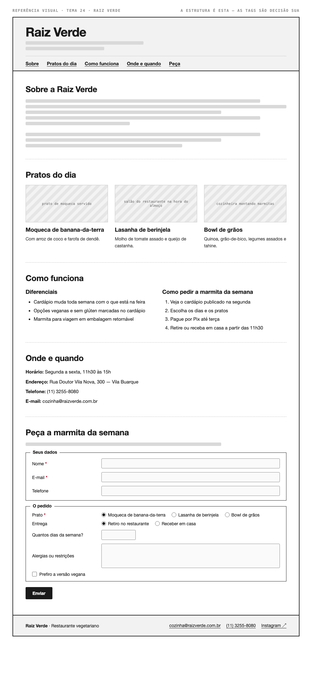

# Tema 24 · Raiz Verde

**Restaurante vegetariano** · Vila Buarque, São Paulo

A imagem acima mostra a página montada, só para você **ler a hierarquia**: o que é o título principal, o que é título de seção, o que é item dentro de uma seção, o que é lista e de que tipo, como os campos do formulário se agrupam. Ela não tem nenhuma tag escrita — descobrir qual tag produz cada pedaço é a prova. E não é para reproduzir o visual: a sua página não terá CSS e vai ficar diferente disso, o que é esperado.

Este é o conteúdo da sua página. Os fatos são estes; **o texto é seu** — escreva os parágrafos com as suas palavras, em português correto, no tom que combina com a organização. Os itens das listas e os dados da tabela final podem ir como estão; a apresentação e as descrições dos artigos, não — reescreva.

O que você **não** decide: a estrutura mínima exigida no enunciado. O que você decide: qual tag marca cada pedaço deste conteúdo.

---

## Quem é

Raiz Verde é restaurante vegetariano em Vila Buarque, São Paulo. Escreva um parágrafo de apresentação (2 a 4 frases) e um slogan curto. Invente o que faltar — ano de fundação, quem fundou, por quê — desde que seja coerente com o resto.

## Pratos do dia — os 3 artigos

Cada item vira um `<article>` com título, um parágrafo e uma imagem.

- **Moqueca de banana-da-terra** — com arroz de coco e farofa de dendê
- **Lasanha de berinjela** — molho de tomate assado e queijo de castanha
- **Bowl de grãos** — quinoa, grão-de-bico, legumes assados e tahine

## Diferenciais — lista não ordenada

- Cardápio muda toda semana com o que está na feira
- Opções veganas e sem glúten marcadas no cardápio
- Marmita para viagem em embalagem retornável

## Como pedir a marmita da semana — lista ordenada

1. Veja o cardápio publicado na segunda
2. Escolha os dias e os pratos
3. Pague por Pix até terça
4. Retire ou receba em casa a partir das 11h30

## Dados — quatro parágrafos

Sem `<dl>` (não vimos em aula): um parágrafo por dado, com o rótulo em destaque no início.

| | |
| --- | --- |
| Horário | Segunda a sexta, 11h30 às 15h |
| Endereço | Rua Doutor Vila Nova, 300 — Vila Buarque |
| Telefone | (11) 3255-8080 |
| E-mail | cozinha@raizverde.com.br |

## Peça a marmita da semana — formulário

A quinta seção é um formulário. Os campos fixos, iguais para todo mundo: **nome** (texto), **e-mail** e **telefone**. Os campos específicos do seu tema (sem `<select>` — não vimos em aula):

| Campo | Tipo | Opções |
| --- | --- | --- |
| Prato | escolha única, todas as opções visíveis | Moqueca de banana-da-terra · Lasanha de berinjela · Bowl de grãos |
| Entrega | escolha única, todas as opções visíveis | Retiro no restaurante · Receber em casa |
| Quantos dias da semana? | número | — |
| Alergias ou restrições | texto longo | — |
| Prefiro a versão vegana | marcar ou não | — |

Agrupe os campos em **dois blocos** com título — "Seus dados" e "O pedido", ou o que fizer sentido — e termine com o botão de envio. Decida você quais campos são obrigatórios. A tabela diz o *tipo de informação*; qual tag e qual `type` traduzem isso é decisão sua.

## Imagens

Três fotos, uma por artigo: prato de moqueca servido, salão do restaurante na hora do almoço, cozinheira montando marmitas.

Use imagens de placeholder — `https://picsum.photos/400/300` serve — ou qualquer foto livre. **O que é avaliado é o `alt`**, que precisa descrever a foto como se ela não carregasse. O `alt` é o único lugar em que você usa o texto desta seção.
