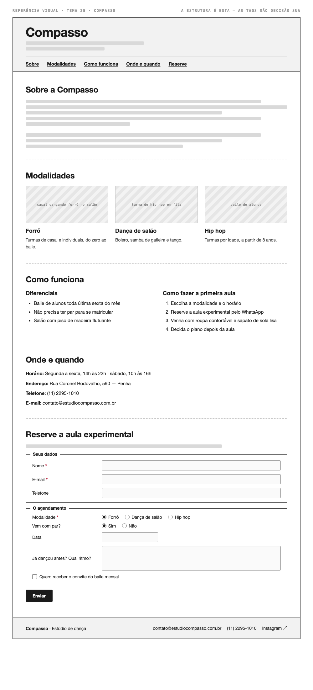

# Tema 25 · Compasso

**Estúdio de dança** · Penha, São Paulo

A imagem acima mostra a página montada, só para você **ler a hierarquia**: o que é o título principal, o que é título de seção, o que é item dentro de uma seção, o que é lista e de que tipo, como os campos do formulário se agrupam. Ela não tem nenhuma tag escrita — descobrir qual tag produz cada pedaço é a prova. E não é para reproduzir o visual: a sua página não terá CSS e vai ficar diferente disso, o que é esperado.

Este é o conteúdo da sua página. Os fatos são estes; **o texto é seu** — escreva os parágrafos com as suas palavras, em português correto, no tom que combina com a organização. Os itens das listas e os dados da tabela final podem ir como estão; a apresentação e as descrições dos artigos, não — reescreva.

O que você **não** decide: a estrutura mínima exigida no enunciado. O que você decide: qual tag marca cada pedaço deste conteúdo.

---

## Quem é

Compasso é estúdio de dança em Penha, São Paulo. Escreva um parágrafo de apresentação (2 a 4 frases) e um slogan curto. Invente o que faltar — ano de fundação, quem fundou, por quê — desde que seja coerente com o resto.

## Modalidades — os 3 artigos

Cada item vira um `<article>` com título, um parágrafo e uma imagem.

- **Forró** — turmas de casal e individuais, do zero ao baile
- **Dança de salão** — bolero, samba de gafieira e tango
- **Hip hop** — turmas por idade, a partir de 8 anos

## Diferenciais — lista não ordenada

- Baile de alunos toda última sexta do mês
- Não precisa ter par para se matricular
- Salão com piso de madeira flutuante

## Como fazer a primeira aula — lista ordenada

1. Escolha a modalidade e o horário
2. Reserve a aula experimental pelo WhatsApp
3. Venha com roupa confortável e sapato de sola lisa
4. Decida o plano depois da aula

## Dados — quatro parágrafos

Sem `<dl>` (não vimos em aula): um parágrafo por dado, com o rótulo em destaque no início.

| | |
| --- | --- |
| Horário | Segunda a sexta, 14h às 22h · sábado, 10h às 16h |
| Endereço | Rua Coronel Rodovalho, 590 — Penha |
| Telefone | (11) 2295-1010 |
| E-mail | contato@estudiocompasso.com.br |

## Reserve a aula experimental — formulário

A quinta seção é um formulário. Os campos fixos, iguais para todo mundo: **nome** (texto), **e-mail** e **telefone**. Os campos específicos do seu tema (sem `<select>` — não vimos em aula):

| Campo | Tipo | Opções |
| --- | --- | --- |
| Modalidade | escolha única, todas as opções visíveis | Forró · Dança de salão · Hip hop |
| Vem com par? | escolha única, todas as opções visíveis | Sim · Não |
| Data | data | — |
| Já dançou antes? Qual ritmo? | texto longo | — |
| Quero receber o convite do baile mensal | marcar ou não | — |

Agrupe os campos em **dois blocos** com título — "Seus dados" e "O agendamento", ou o que fizer sentido — e termine com o botão de envio. Decida você quais campos são obrigatórios. A tabela diz o *tipo de informação*; qual tag e qual `type` traduzem isso é decisão sua.

## Imagens

Três fotos, uma por artigo: casal dançando forró no salão, turma de hip hop em fila, baile de alunos.

Use imagens de placeholder — `https://picsum.photos/400/300` serve — ou qualquer foto livre. **O que é avaliado é o `alt`**, que precisa descrever a foto como se ela não carregasse. O `alt` é o único lugar em que você usa o texto desta seção.
