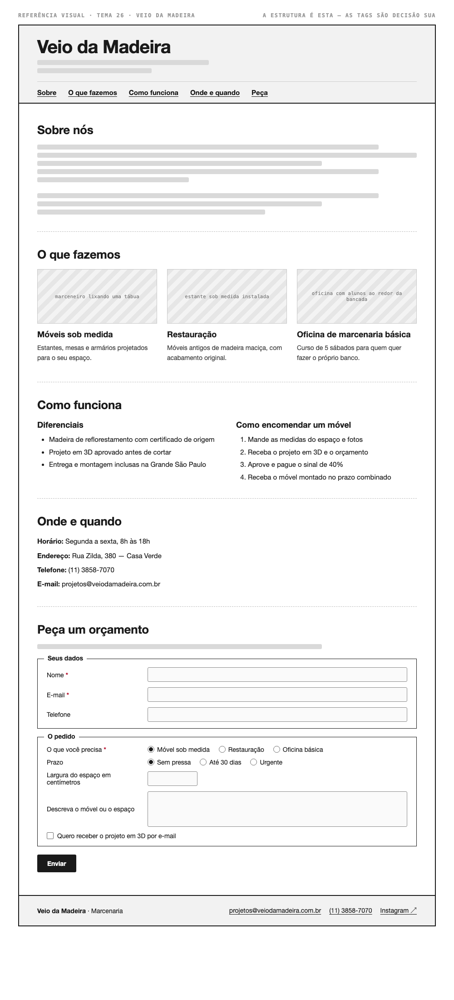

# Tema 26 · Veio da Madeira

**Marcenaria** · Casa Verde, São Paulo

A imagem acima mostra a página montada, só para você **ler a hierarquia**: o que é o título principal, o que é título de seção, o que é item dentro de uma seção, o que é lista e de que tipo, como os campos do formulário se agrupam. Ela não tem nenhuma tag escrita — descobrir qual tag produz cada pedaço é a prova. E não é para reproduzir o visual: a sua página não terá CSS e vai ficar diferente disso, o que é esperado.

Este é o conteúdo da sua página. Os fatos são estes; **o texto é seu** — escreva os parágrafos com as suas palavras, em português correto, no tom que combina com a organização. Os itens das listas e os dados da tabela final podem ir como estão; a apresentação e as descrições dos artigos, não — reescreva.

O que você **não** decide: a estrutura mínima exigida no enunciado. O que você decide: qual tag marca cada pedaço deste conteúdo.

---

## Quem é

Veio da Madeira é marcenaria em Casa Verde, São Paulo. Escreva um parágrafo de apresentação (2 a 4 frases) e um slogan curto. Invente o que faltar — ano de fundação, quem fundou, por quê — desde que seja coerente com o resto.

## O que fazemos — os 3 artigos

Cada item vira um `<article>` com título, um parágrafo e uma imagem.

- **Móveis sob medida** — estantes, mesas e armários projetados para o seu espaço
- **Restauração** — móveis antigos de madeira maciça, com acabamento original
- **Oficina de marcenaria básica** — curso de 5 sábados para quem quer fazer o próprio banco

## Diferenciais — lista não ordenada

- Madeira de reflorestamento com certificado de origem
- Projeto em 3D aprovado antes de cortar
- Entrega e montagem inclusas na Grande São Paulo

## Como encomendar um móvel — lista ordenada

1. Mande as medidas do espaço e fotos
2. Receba o projeto em 3D e o orçamento
3. Aprove e pague o sinal de 40%
4. Receba o móvel montado no prazo combinado

## Dados — quatro parágrafos

Sem `<dl>` (não vimos em aula): um parágrafo por dado, com o rótulo em destaque no início.

| | |
| --- | --- |
| Horário | Segunda a sexta, 8h às 18h |
| Endereço | Rua Zilda, 380 — Casa Verde |
| Telefone | (11) 3858-7070 |
| E-mail | projetos@veiodamadeira.com.br |

## Peça um orçamento — formulário

A quinta seção é um formulário. Os campos fixos, iguais para todo mundo: **nome** (texto), **e-mail** e **telefone**. Os campos específicos do seu tema (sem `<select>` — não vimos em aula):

| Campo | Tipo | Opções |
| --- | --- | --- |
| O que você precisa | escolha única, todas as opções visíveis | Móvel sob medida · Restauração · Oficina básica |
| Prazo | escolha única, todas as opções visíveis | Sem pressa · Até 30 dias · Urgente |
| Largura do espaço em centímetros | número | — |
| Descreva o móvel ou o espaço | texto longo | — |
| Quero receber o projeto em 3D por e-mail | marcar ou não | — |

Agrupe os campos em **dois blocos** com título — "Seus dados" e "O pedido", ou o que fizer sentido — e termine com o botão de envio. Decida você quais campos são obrigatórios. A tabela diz o *tipo de informação*; qual tag e qual `type` traduzem isso é decisão sua.

## Imagens

Três fotos, uma por artigo: marceneiro lixando uma tábua, estante sob medida instalada, oficina com alunos ao redor da bancada.

Use imagens de placeholder — `https://picsum.photos/400/300` serve — ou qualquer foto livre. **O que é avaliado é o `alt`**, que precisa descrever a foto como se ela não carregasse. O `alt` é o único lugar em que você usa o texto desta seção.
